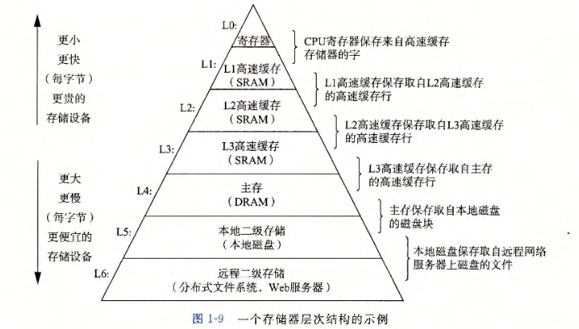
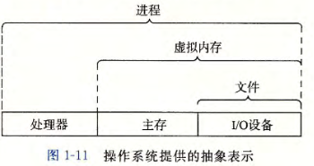

# 第一章 计算机系统漫游

## 1.1 信息就是位 + 上下文

1. 系统中的所有信息——包括磁盘文件、内存中的程序、内存中存放的用户数据以及网络上传送的数据，都是由一串比特（一个由0和1组成的位）表示的
2. 区分不同数据对象的唯一方法是我们读到这些数据对象的上下文

### 1.4.1 系统的硬件组成

1. 总线：贯穿整个系统的一组电子管道，携带信息字节并负责在各个部件间传递
2. 主存：临时存储设备，用来存放程序和程序处理的数据，由一组DRAM（动态随机存取存储器）
3. 处理器：解释/执行存储在主存中指令的引擎
   1. 程序计数器：在任何时刻都指向主存中的某条机器语言指令
   2. 寄存器文件：小的存储设备，由一些单个字长的寄存器构成
   3. 算术/逻辑单元（ALU）

### 1.4.2 运行hello程序

`./hello`然后回车以后，

1. 存储在磁盘上的hello可执行文件被复制到主存
2. 处理器开始执行hello程序中的机器语言指令
3. 字符串中的字节从主存复制岛寄存器文件，再复制到显示设备

## 1.6 存储设备形成层次结构

存储器层次结构的主要思想是上一层的存储器作为低一层存储器的高速缓存

## 1.7 操作系统管理硬件

1. 我们可以把操作系统堪称是应用程序和硬件之间插入的一层软件，所有应用程序对硬件的操作都必须通过操作系统

   1. 防止硬件被失控的应用程序滥用
   2. 向应用程序提供简单一致的机制来控制复杂而又通常大不相同的低级硬件设备

2. 操作系统过的抽象表示

   

### 1.7.1 进程

进程是计算机科学中最重要和最成功的概念之一

1. 进程是操作系统对一个正在运行的程序的一种抽象
2. 上下文切换：操作系统实现交错执行的机制，保存当前进程的上下文，恢复新进程的上下文，将控制权传递到新进程
3. 上下文：操作系统保持跟踪进程运行所需要的所有状态信息
   1. PC（Program Counter）和寄存器文件当前的值
   2. 主存的内容
   3. …
4. 从一个进程到另一个进程的转换是由操作系统**内核**（Kernel）管理的
   1. 内核是操作系统代码常驻主存的部分
   2. 内核是系统管理全部进程所用代码和数据结构的集合

### 1.7.2 线程

1. 一个进程可以由多个称为线程的执行单元组成
2. 每个线程都运行在进程的上下文中，并共享同样的代码和全局数据

### 1.7.3 虚拟内存

1. 虚拟内存为每个进程提供一个假象：每个进程都在独占的使用主存
2. 每个进程看到的内存都是一致的，称为虚拟地址空间

### 1.7.4 文件

文件就是字节序列，仅此而已

# 第二章 信息的表示和处理

