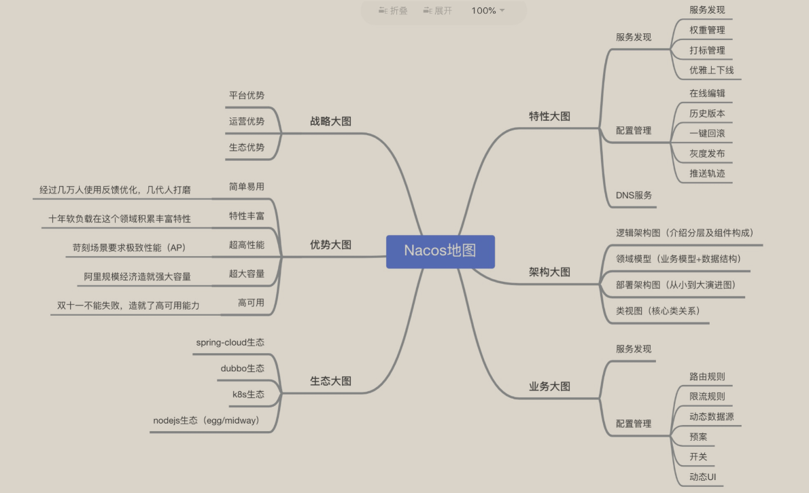

# nacos

Created: June 6, 2022 3:25 PM
Last Edited Time: August 19, 2022 10:36 AM
Status: In Progress 🙌
Type: middleware

# Reference

[Nacos doc](https://nacos.io/en-us/docs/what-is-nacos.html)

# Overview

1. **Service is a first-class citizen in Nacos**. Nacos supports discovering, configuring, and managing almost all types of services (eg: gRPC, Dubbo, Spring Cloud… )
2. Key features:
    1. service discovery and service health check
    2. dynamic configuration management
    3. dynamic DNS service
    4. service governance and metadata management

## Difference between 1.0 and 2.0

1. two main goals in the 1.0 stage
    1. build a simple and easy to use, service-related set of tools, including service discovery, configuration management, service metadata storage, push, consistency and metadata management …
    2. seamless integration with and support for open-source ecosystems including Spring Cloud, Kubernetes, Dubbo
2. two key areas of focus in the 2.0 stage
    1. Dubbo4.0 + Nacos2.0: An Open-Service Platform
    2. Kubernetes + Spring Cloud: Unified Service Management

## Nacos Map

a picture to understand nacos



## Nacos landscape


# Concepts

1. Region: physical data centers, unalterable after resources are created
2. Available Zone: physical areas with independent power grids and networks in one region
3. Endpoint: the entry domain name of a service in each region
4. Namespace: for configuration isolation by tenants
5. Configuration: just configuration
6. Configuration Management: editing, storage, distribution, modification management …
7. Configuration Item: a specific configurable parameter with its value range(logLevel=INFO|WARN|ERROR)
8. Configuration Set: a collection of related or unrelated configuration items in a system
9. Data ID: the ID of a configuration set in Nacos
10. Group: the group of configuration sets in nacos
11. Configuration Snapshot
12. Service: software functions which are provided to the client via the network through a predefined interface
13. Service Name: identifier provider by the service
14. Service Registry: database which stores the instances of services and the load balancing policies for services
15. Service Discovery: on a computer network, the address and metadata of an instance under the service are probed and provided to the client for querying with a predefined interface
16. Metadata: custom configuration information
17. Application: property of service which can be used to identify the service provider
18. Service Group
19. Virtual Cluster: all service instances under the same service form a default cluster, which can be further divided on demand, either as a virtual cluster
20. Instance: a process with an accessible network address(IP:Port) that provides one or more services
21. Weight: instance-level configuration
22. Health Check: a specified manner to ensure the instances can work properly
23. Protect Threshold: defined as a floating point number between 0 and 1

# Nacos architecture

## Data Model


## Service Entity Relationship Model


## Artifacts, Deployment, and Start Mode

### Two Artifacts

Nacos supports both standard Docker images and nacos-.zip(tar.gz)

### Two Start Modes

standalone and cluster

### Free Public Cloud Service on Alibaba Cloud

# Quick Start

# Deployment Guide

## Three types of  deployment modes

1. Standalone mode: for DEV/TEST env
2. Cluster Mode: used in PROD env to ensure high-availability
3. Multi-Cluster Mode: you may want to deploy multi-cluster mode to support different business units

## Running Nacos in Standalone Mode

`sh startup.sh -m standalone`

## IP Selection of Multiple Network Cards

1. when the local environment is complex, the **nacos service needs to choose IP or network card** to use at runtime when it starts up
2. example
    - ip-address parameter can set nacos ip directly
    
    `nacos.inetutils.ip-address=10.11.105.155`
    
    - `use-only-site-local-interfaces` allow nacos to use LAN IP, which is useful when nacos deploys a machine with multiple network cards
    
    `nacos.inetutils.use-only-site-interfaces = true` 
    
    - `ignored-interfaces` allow nacos to ignore multiple network cards
    
    `nacos.inetutils.ignored-interfaces[0]=eth0
     nacos.inetutils.ignored-interfaces[1]=eth1`
    
    - `prefereed-networks` allow nacos to select the matching IP preferentially and support regular matching and prefix matching
    
    `nacos.inetutils.preferred-networks[0]=30.5.124.
    nacos.inetutils.preferred-networks[0]=30.5.124.(25[0-5]|2[0-4]\\d|((1d{2})|([1-9]?\\d))),30.5.124.(25[0-5]|2[0-4]\\d|((1d{2})|([1-9]?\\d)))`
    
    # Cluster Mode Deployment
    
    ## Cluster Deployment Architecture
    
    
    
    1. http://ip1:port/openAPI
    2. http://SLB:port/openAPI
    3. [http://nacos.com/openAPI](http://nacos.com/openAPI): recommended mode
    
    ## Steps
    
    ### complete nacos install
    
    playbook already did
    
    ### Configuration Cluster Profile
    
    {Your directory}/nacos/conf/cluster.conf
    
    ```bash
    # ip:port
    200.8.9.16:8848
    200.8.9.17:8848
    200.8.9.18:8848
    ```
    
    ### Determine The DataSource
    
    /nacos/conf/ncaos-mysql.sql —> initial this file in your mysql
    
    more details in /nacos/conf/appication.properties
    
    1. use bulit-in data sources
        1. no configuration required
    2. use an external data source
        1. use at least backup mode
    
    ### Start server
    
    1. built-in data source
       
        `sh startup.sh -p embedded`
        
    2. external data source
       
        `sh startup.sh`