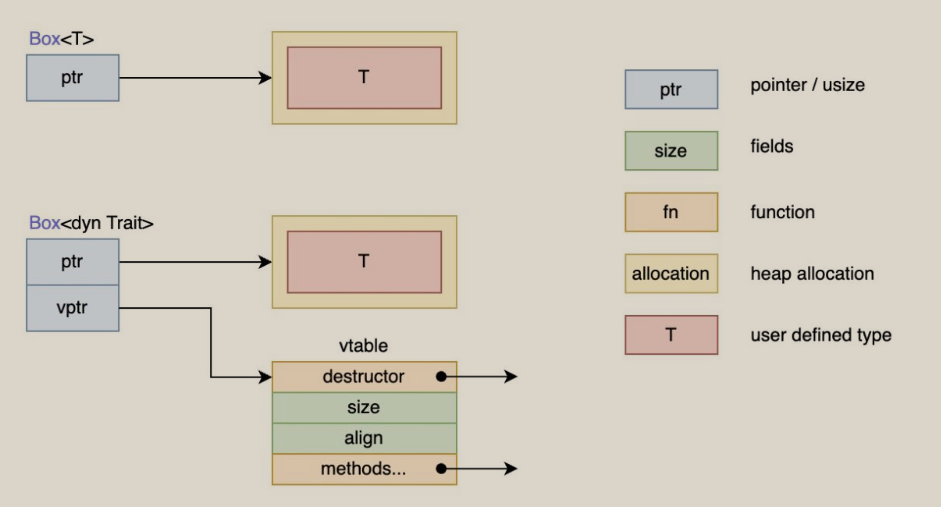

[Rust 语言圣经 - Rust 语言圣经 (Rust Course)](https://course.rs/about-book.html)

[toc]

# 1. 快速开始

1. 什么情况下该把 `Cargo.lock` 上传到 git 仓库里？很简单，当你的项目是一个可运行的程序时，就上传 `Cargo.lock`，如果是一个依赖库项目，那么请把它添加到 `.gitignore` 中

# 2. Rust基础入门

## 2.1 变量绑定与解构

### 使用下划线开头忽略未使用的变量 

`let _unused = 5;`

### 变量解构

从一个相对复杂的变量中，匹配出该变量的一部分内容

应该是对应destructing

## 2.2 基本类型

### 2.2.1 数值类型

#### 整形溢出

当在 debug 模式编译时，Rust 会检查整型溢出，若存在这些问题，则使程序在编译时*panic*

在当使用 `--release` 参数进行 release 模式构建时，Rust**不**检测溢出 （当检测到整型溢出时，Rust 会按照补码循环溢出（*two’s complement wrapping*）的规则处理）

#### 浮点数陷阱

- 避免在浮点数上测试相等性
- 当结果在数学上可能存在未定义时，需要格外的小心

```rust
fn main() {
  // 断言0.1 + 0.2与0.3相等，会 panic
  assert!(0.1 + 0.2 == 0.3);
}
```

`f32` 下的 `0.1 + 0.2 == 0.3` 通过测试，但是到了 `f64` 类型时，结果就不一样了，因为 `f64` 精度高很多，因此在小数点非常后面发生了一点微小的变化

#### NAN

所有跟 `NaN` 交互的操作，都会返回一个 `NaN`，而且 `NaN` 不能用来比较

`is_nan()`可以用来判断一个数值是否是 `NaN`

#### 数字运算

只有同样类型，才能运算

#### 序列

`1..5`: 1,2,3,4,

`1..=5`: 1,2,3,4,5

序列只允许用于数字或字符类型, 字符和数字值是 Rust 中仅有的可以用于判断是否为空的类型

#### 差异

- 类型转换必须是显式的. Rust 永远也不会偷偷把你的 16bit 整数转换成 32bit 整数
- Rust 的数值上可以使用方法. 例如你可以用以下方法来将 `13.14` 取整：`13.14_f32.round()`

### 2.2.3 语句和表达式

能返回值，它就是表达式:

**表达式不能包含分号**

表达式如果不返回任何值，会隐式地返回一个 `()`

### 2.2.4 函数

- 函数没有返回值，那么返回一个 `()`
- 通过 `;` 结尾的表达式返回一个 `()`
- 当用 `!` 作函数返回类型的时候，表示该函数永不返回 (diverge function)，特别的，这种语法往往用做会导致程序崩溃的函数

## 2.3 所有权和借用

### 2.3.1 所有权

#### 栈和堆

1. 栈中的所有数据都必须占用已知且固定大小的内存空间

2. 对于大小未知或者可能变化的数据，我们需要将它存储在堆上，堆是一种缺乏组织的数据结构
3. 入栈比在堆上分配内存要快，访问堆上的数据比访问栈上的数据慢
4. 当你的代码调用一个函数时，传递给函数的参数（包括可能指向堆上数据的指针和函数的局部变量）依次被压入栈中，当函数调用结束时，这些值将被从栈中按照相反的顺序依次移除

#### 所有权原则

1. Rust 中每一个值都被一个变量所拥有，该变量被称为值的所有者
2. 一个值同时只能被一个变量所拥有，或者说一个值只能拥有一个所有者
3. 当所有者 (变量) 离开作用域范围时，这个值将被丢弃 (drop)


1. **Rust 永远也不会自动创建数据的 “深拷贝”**。因此，任何**自动**的复制都不是深拷贝

2. **任何基本类型的组合可以 `Copy` ，不需要分配内存或某种形式资源的类型是可以 `Copy` 的**（copy: 一个旧的变量在被赋值给其他变量后仍然可用）

3. `move`: 浅拷贝 + drop原始变量
4. 将值传递给函数，一样会发生 `move` 或者 `copy`

### 2.3.2 引用与借用

**获取变量的引用，称之为借用 (borrowing)**

1. 正如变量默认不可变一样，引用指向的值默认也是不可变的
2. **同一作用域，特定数据只能有一个可变引用**
3. 可变引用与不可变引用不能同时存在

- 同一时刻，你只能拥有要么一个可变引用，要么任意多个不可变引用
- 引用必须总是有效的

## 2.4 复合类型

### 2.4.1 字符串与切片

#### 切片

1. 切片允许你引用集合中部分连续的元素序列，而不是引用整个集合。

2. 在对字符串使用切片语法时需要格外小心，切片的索引必须落在字符之间的边界位置，也就是 UTF-8 字符的边界，例如中文在 UTF-8 中占用三个字节

#### 字符串

1. **Rust 中的字符是 Unicode 类型，因此每个字符占据 4 个字节内存空间，字符串是 UTF-8 编码，也就是字符串中的字符所占的字节数是变化的 (1 - 4)**

### 2.4.2 元组

元组的长度是固定的，元组中元素的顺序也是固定的，可以使用模式匹配或者 `.` 操作符来获取元组中的值

### 2.4.3 结构体

1. 当函数参数和结构体字段同名时，可以直接使用缩略的方式进行初始化

2. 元组结构体在你希望有一个整体名称，但是又不关心里面字段的名称时将非常有用 `struct Color(i32, i32, i32); `

3. 如果你定义一个类型，但是不关心该类型的内容，只关心它的行为时，就可以使用

```rust
struct AlwaysEqual;

let subject = AlwaysEqual;

// 我们不关心 AlwaysEqual 的字段数据，只关心它的行为，因此将它声明为单元结构体，然后再为它实现某个特征
impl SomeTrait for AlwaysEqual {

}
```

抽象类actually

### 2.4.5 数组

在 Rust 中，最常用的数组有两种，第一种是速度很快但是**长度固定**的 `array`，第二种是可动态增长的但是有性能损耗的 `Vector`

- `[u8; 3]` 和 `[u8; 4]` 是不同的类型，数组的长度也是类型的一部分
- **在实际开发中，使用最多的是数组切片 [T]**，我们往往通过引用的方式去使用 `&[T]`，因为后者有固定的类型大小

## 2.5 流程控制

| 使用方法                      | 等价使用方式                                      | 所有权     |
| ----------------------------- | ------------------------------------------------- | ---------- |
| `for item in collection`      | `for item in IntoIterator::into_iter(collection)` | 转移所有权 |
| `for item in &collection`     | `for item in collection.iter()`                   | 不可变借用 |
| `for item in &mut collection` | `for item in collection.iter_mut()`               | 可变借用   |

```rust
// 不想单独声明一个变量来控制这个流程
for _ in 0..10 {
  // ...
}
```

- **break 可以单独使用，也可以带一个返回值**，有些类似 `return`
- **loop 是一个表达式**，因此可以返回一个值

## 2.6 模式匹配

### 2.6.1 match和if let

- `match` 的匹配必须要穷举出所有可能，因此这里用 `_` 来代表未列出的所有可能性
- `match` 的每一个分支都必须是一个表达式，且所有分支的表达式最终返回值的类型必须相同
- **X | Y**，类似逻辑运算符 `或`，代表该分支可以匹配 `X` 也可以匹配 `Y`，只要满足一个即可

**当你只要匹配一个条件，且忽略其他条件时就用 `if let` ，否则都用 `match`**

#### 变量覆盖：

```rust
fn main() {
   let age = Some(30);
   println!("在匹配前，age是{:?}",age);
   if let Some(age) = age {
       println!("匹配出来的age是{}",age);
   }

   println!("在匹配后，age是{:?}",age);
}
```

### 2.6.4 全模式列表

### @绑定

当你既想要限定分支范围，又想要使用分支的变量时，就可以用 `@` 来绑定到一个新的变量上，实现想要的功能。

```rust

enum Message {
    Hello { id: i32 },
}

let msg = Message::Hello { id: 5 };

match msg {
    Message::Hello { id: id_variable @ 3..=7 } => {
        println!("Found an id in range: {}", id_variable)
    },
}
```

## 2.7 方法

### self, &self, &mut self

1. `&self` 其实是 `self: &Self` 的简写
2. `Self` 指代被实现方法的结构体类型，`self` 指代此类型的实例
3. `self` 依然有所有权的概念

### 方法名跟结构体字段名相同

一般来说，方法跟字段同名，往往适用于实现 `getter` 访问器

### 关联函数

定义在 `impl` 中且没有 `self` 的函数（不是方法，不能通过`.`调用）

### 为枚举实现方法

`impl`同样适用于枚举

## 2.8 泛型和特征

### 2.8.1 泛型

#### 为具体的泛型类型实现方法

```rust
impl Point<f32> {
    fn distance_from_origin(&self) -> f32 {
        (self.x.powi(2) + self.y.powi(2)).sqrt()
    }
}
```

#### const 泛型

```rust
fn display_array<T: std::fmt::Debug, const N: usize>(arr: [T; N]) {
    println!("{:?}", arr);
}
fn main() {
    let arr: [i32; 3] = [1, 2, 3];
    display_array(arr);

    let arr: [i32; 2] = [1, 2];
    display_array(arr);
}
```

`N` 就是 const 泛型，定义的语法是 `const N: usize`，表示 const 泛型 `N` ，它基于的值类型是 `usize`

#### 泛型的性能

Rust 通过在编译时进行泛型代码的 **单态化** ( *monomorphization*) 来保证效率。单态化是一个通过填充编译时使用的具体类型，将通用代码转换为特定代码的过程

### 2.8.2 特征

#### 特征约束

```rust
pub fn notify<T: Summary>(item: &T) {
    println!("Breaking news! {}", item.summarize());
}
pub fn notify<T: Summary>(item1: &T, item2: &T) {}
//多重约束
pub fn notify<T: Summary + Display>(item: &T) {}
//where约束
fn some_function<T, U>(t: &T, u: &U) -> i32
    where T: Display + Clone,
          U: Clone + Debug
{}
```

### 2.8.3 特征对象

特征约束限制了只能有一个满足条件的类型，如果需要同时使用实现了特征的N个对象，需要用到特征对象

`dyn trait_name`

- **特征对象大小不固定**
- **几乎总是使用特征对象的引用方式**



#### 特征对象的限制

不是所有特征都能拥有特征对象，只有对象安全的特征才行。当一个特征的所有方法都有如下属性时，它的对象才是安全的：

- 方法的返回类型不能是 `Self`
- 方法没有任何泛型参数

### 2.8.4 进一步深入特征

#### 调用同名方法

```rust
trait Pilot {
    fn fly(&self);
}

trait Wizard {
    fn fly(&self);
}

struct Human;

impl Pilot for Human {
    fn fly(&self) {
        println!("This is your captain speaking.");
    }
}

impl Wizard for Human {
    fn fly(&self) {
        println!("Up!");
    }
}

impl Human {
    fn fly(&self) {
        println!("*waving arms furiously*");
    }
}
//当方法的参数是self
fn main() {
    let person = Human;
    Pilot::fly(&person); // 调用Pilot特征上的方法
    Wizard::fly(&person); // 调用Wizard特征上的方法
    person.fly(); // 调用Human类型自身的方法
}
```

当方法没有self参数，需要使用完全限定语法
`<Type as Trait>::function(receiver_if_method, next_arg, ...);`

```rust
trait Animal {
    fn baby_name() -> String;
}

struct Dog;

impl Dog {
    fn baby_name() -> String {
        String::from("Spot")
    }
}

impl Animal for Dog {
    fn baby_name() -> String {
        String::from("puppy")
    }
}

fn main() {
    println!("A baby dog is called a {}", <Dog as Animal>::baby_name());
}
```

只有当存在多个同名函数或方法，且 Rust 无法区分出你想调用的目标函数时，该用法才能真正有用武之地

## 2.10 类型转换

```rust
let array: Rc<Box<[T; 3]>> = ...;
let first_entry = array[0];
```

1. 首先， `array[0]` 只是 [`Index`](https://doc.rust-lang.org/std/ops/trait.Index.html)特征的语法糖：编译器会将 `array[0]` 转换为 `array.index(0)` 调用，当然在调用之前，编译器会先检查 `array` 是否实现了 `Index` 特征。
2. 接着，编译器检查 `Rc<Box<[T; 3]>>` 是否有实现 `Index` 特征，结果是否，不仅如此，`&Rc<Box<[T; 3]>>` 与 `&mut Rc<Box<[T; 3]>>` 也没有实现。
3. 上面的都不能工作，编译器开始对 `Rc<Box<[T; 3]>>` 进行解引用，把它转变成 `Box<[T; 3]>`
4. 此时继续对 `Box<[T; 3]>` 进行上面的操作 ：`Box<[T; 3]>`， `&Box<[T; 3]>`，和 `&mut Box<[T; 3]>` 都没有实现 `Index` 特征，所以编译器开始对 `Box<[T; 3]>` 进行解引用，然后我们得到了 `[T; 3]`
5. `[T; 3]` 以及它的各种引用都没有实现 `Index` 索引 (是不是很反直觉：D，在直觉中，数组都可以通过索引访问，实际上只有数组切片才可以！)，它也不能再进行解引用，因此编译器只能祭出最后的大杀器：将定长转为不定长，因此 `[T; 3]` 被转换成 `[T]`，也就是数组切片，它实现了 `Index` 特征，因此最终我们可以通过 `index` 方法访问到对应的元素。

通用表达

1. 首先，编译器检查它是否可以直接调用 `T::foo(value)`，称之为**值方法调用**
2. 如果上一步调用无法完成 (例如方法类型错误或者特征没有针对 `Self` 进行实现，上文提到过特征不能进行强制转换)，那么编译器会尝试增加自动引用，例如会尝试以下调用： `<&T>::foo(value)` 和 `<&mut T>::foo(value)`，称之为**引用方法调用**
3. 若上面两个方法依然不工作，编译器会试着解引用 `T` ，然后再进行尝试。这里使用了 `Deref` 特征 —— 若 `T: Deref<Target = U>` (`T` 可以被解引用为 `U`)，那么编译器会使用 `U` 类型进行尝试，称之为**解引用方法调用**
4. 若 `T` 不能被解引用，且 `T` 是一个定长类型 (在编译器类型长度是已知的)，那么编译器也会尝试将 `T` 从定长类型转为不定长类型，例如将 `[i32; 2]` 转为 `[i32]`
5. 若还是不行，那... 没有那了，最后编译器大喊一声：汝欺我甚，不干了！

## 2.12 包和模块

典型的Package结构

```rust
.
├── Cargo.toml
├── Cargo.lock
├── src
│   ├── main.rs
│   ├── lib.rs
│   └── bin
│       └── main1.rs
│       └── main2.rs
├── tests
│   └── some_integration_tests.rs
├── benches
│   └── simple_bench.rs
└── examples
    └── simple_example.rs

```

- 唯一库包：`src/lib.rs`
- 默认二进制包：`src/main.rs`，编译后生成的可执行文件与 `Package` 同名
- 其余二进制包：`src/bin/main1.rs` 和 `src/bin/main2.rs`，它们会分别生成一个文件同名的二进制可执行文件
- 集成测试文件：`tests` 目录下
- 基准性能测试 `benchmark` 文件：`benches` 目录下
- 项目示例：`examples` 目录下

### 2.12.3 使用use引入模块及受限可见性

#### 限制性语法

- `pub` 意味着可见性无任何限制
- `pub(crate)` 表示在当前包可见
- `pub(self)` 在当前模块可见
- `pub(super)` 在父模块可见
- `pub(in <path>)` 表示在某个路径代表的模块中可见，其中 `path` 必须是父模块或者祖先模块

## 2.13 文档注释

- 文档注释需要位于 `lib` 类型的包中，例如 `src/lib.rs` 中
- 文档注释可以使用 `markdown` 语法！例如 `# Examples` 的标题，以及代码块高亮
- 被注释的对象需要使用 `pub` 对外可见，记住：文档注释是给用户看的，**内部实现细节不应该被暴露出去**

文档行注释：`///`

文档块注释：`/**...*/`

包/模块行注释：`//!`

包/模块块注释：`/*! ... */`


# 3. Rust高级进阶

## 3.1 生命周期

### 3.1.1 认识生命周期

**生命周期标注并不会改变任何引用的实际作用域**

#### 函数签名中的生命周期标注

```rust
fn longest<'a>(x: &'a str, y: &'a str) -> &'a str {
    if x.len() > y.len() {
        x
    } else {
        y
    }
}
```

该函数签名表明对于某些生命周期 `'a`，函数的两个参数都至少跟 `'a` 活得一样久

**在通过函数签名指定生命周期参数时，我们并没有改变传入引用或者返回引用的真实生命周期，而是告诉编译器当不满足此约束条件时，就拒绝编译通过**

#### 深入思考生命周期标注

**函数的返回值如果是一个引用类型，那么它的生命周期只会来源于**：

- 函数参数的生命周期
- 函数体中某个新建引用的生命周期 （dangling pointer）

生命周期语法用来将函数的多个引用参数和返回值的作用域关联到一起，一旦关联到一起后，Rust 就拥有充分的信息来确保我们的操作是内存安全的。

#### 生命周期约束

- `'a: 'b`，是生命周期约束语法，跟泛型约束非常相似，用于说明 `'a` 必须比 `'b` 活得久
- 可以把 `'a` 和 `'b` 都在同一个地方声明（如上），或者分开声明但通过 `where 'a: 'b` 约束生命周期关系，如下

### 3.1.2 深入生命周期

### 3.1.3 &'static vs T: 'static

**`&'static` 生命周期针对的仅仅是引用，而不是持有该引用的变量，对于变量来说，还是要遵循相应的作用域规则**，比如变量被释放，无法再被访问，但数据依然还会存活


- 如果你需要添加 `&'static` 来让代码工作，那很可能是设计上出问题了
- 如果你希望满足和取悦编译器，那就使用 `T: 'static`，很多时候它都能解决问题

## 3.3 深入类型

### 3.3.2 Sized和不定长类型DST（dynamically sized types）

Rust 中常见的 `DST` 类型有: `str`、`[T]`、`dyn Trait`，**它们都无法单独被使用，必须要通过引用或者 `Box` 来间接使用** 

## 3.4 智能指针

### 3.4.1 Box堆对象分配

- 特意的将数据分配在堆上
- 数据较大时，又不想在转移所有权时进行数据拷贝
- 类型的大小在编译期无法确定，但是我们又需要固定大小的类型时
- 特征对象，用于说明对象实现了一个特征，而不是某个特定的类型