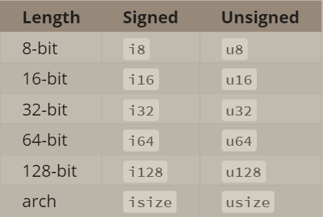
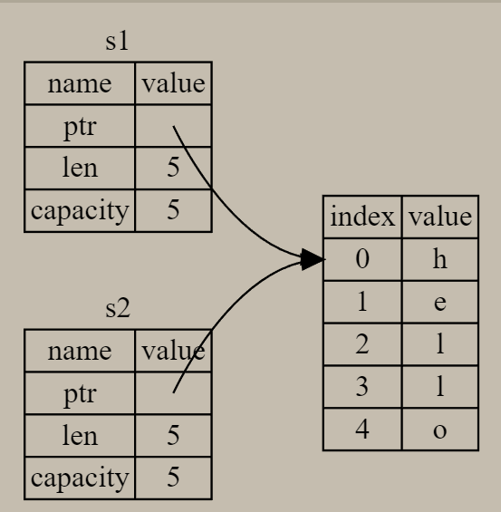

# The Rust Programming Language

Created: August 9, 2022 10:31 PM
Last Edited Time: September 21, 2022 8:42 AM
Status: In Progress 🙌
Type: rust

[The Rust Programming Language](https://doc.rust-lang.org/book/print.html)

# Trouble Shooting

1. when using idea to create a cargo project, meet ”Updating [creates.io](http://creates.io) index” and “no cargo project find”
    1. resolution
    
    [How do I debug `cargo build` hanging at "Updating crates.io index"?](https://stackoverflow.com/questions/53361052/how-do-i-debug-cargo-build-hanging-at-updating-crates-io-index)
    

# Foreward

no matter what kind of code you are writing now, Rust empowers you to reach farther, to program with confidence in a wider variety of domains than you did before

# Introduction

# 1. Getting Started

## 1.1 Installation

on linux: `curl --proto '=https' --tlsv1.2 [https://sh.rustup.rs](https://sh.rustup.rs/) -sSf | sh`

update: `rustup update`

checking: `rustc --version`

## 1.2 Hello, World

```rust
fn main(){
	print!("Hello, world!");
}
```

```bash
rustc main.rs
./main
```

1. using a `!` means that calling a Rust macros instead of a normal function, and that marcos don’t always follow the same rules as functions
2. end the line with ‘;’
3. the main function is special: it is always the first code that runs in every executable Rust program

### Compiling and Running are seprate steps

1. before running a Rust program, must compile it using the Rust compiler by entering the `rustc` and passing it the name of your source file
2. after compiling successfully, Rust outputs a binary executable
3. **Rust is an ahead-of-time compiled language, which** means you can compile a program and give the executable to someone else, and they can run it without having Rust installed

## 1.3 Hello, Cargo

1. cargo is Rust’s build system and package manager
2. *Cargo.lock:* this file keeps track of the exact versions of dependencies in your project
3. `cargo run` : to compile and run the resulting executable all in one command
4. `cargo check` : quickly checks your code to make sure it compiles but doesn’t produce executable
5. `cargo build --release` : compile your code with optimizations, this command creates an executable in *target/release* instead of *target/debug*

# 2. Programming a Guessing Game

```rust
use std::io;// bring the io library into the scope
use rand::Rng;
use std::cmp::Ordering;

fn main() {
    println!("boring guessing game"); // a macro that prints a string to the screen

    // range expression: start..=end, inclusive on the lower and upper bounds
    let secret_number = rand::thread_rng().gen_range(1..=100);
    println!("{secret_number}");

    loop {
        /*
         * In Rust, variables are immutable by default, mut is for mutable
         * The :: syntax in the ::new line indicates that new is an associated function of the String type, An associated function is a function that’s implemented on a type
         * In full, creating a mutable variable that is currently bound to a new, empty instance of a String
         */
        let mut guess = String::new();

        println!("input your number");
        /*
         * & indicates that this argument is a reference, which gives you a way to let multiple parts of your code access one piece of data without needing to copy that data into memory multiple times.
         * Like variables, references are immutable by default.
         */
        io::stdin()
            .read_line(&mut guess)
            .expect("failed to read");

        /*
         * Rust allows us to shadow the previous value of guess with a new one.
         * : after guess tells Rust we’ll annotate the variable’s type
         */
        let guess: u32 = match guess.trim().parse() {
            Ok(num) => num,
            Err(msg) => {
                println!("{msg}");
                continue
            }
        };

        // placeholder {}
        println!("you guessed: {guess}");

        match guess.cmp(&secret_number) {
            Ordering::Less => println!("Too small"),
            Ordering::Greater => println!("Too big"),
            Ordering::Equal => {
                println!("You win");
                break;
            }
        }
    }
}
```

## Handling Potential Failure with the Result Type

1. `.read_line()` returns a `Result` value. *Result is an enumeration* 
    1. Ok: `expect` will take the return value that `Ok` is holding and return just that value to you so you can use it
    2. Err: `expect` will cause the program to crash and display the message that you passed as an argument to `expect`

# 3. Common Programming Concepts

## 3.1 Variables and Mutability

by default variables are immutable, add `mut` in front of the variable name to make it mutable

### Constants

difference between constants and variables

1. not allowed to use `mut` with constants, they are always immutable
2. using `const` instead of `let` keyword, and must annotate the type
3. constants can be declared in any scope
4. constants may be set only to a constant expression, not the result of a value that could only be computed at runtime

naming: all uppercase with underscores between words

### Shadowing

```rust
fn main() {
    let x = 5;

    let x = x + 1; //6

    {
        let x = x * 2; //12
        println!("The value of x in the inner scope is: {x}");
    }

    println!("The value of x is: {x}"); //6
}
```

1. shadowing is different from marking a variable as `mut`, after shadowing, an immutable var is still immutable
2. shadowing spares us from having to come up with different names

## 3.2 Data Types

1. **Every value in Rust is of a certain data type**
2. **Rust is a statically typed language**

### Scalar Types

A scalar type represents a single value

- Integer

    

    1. i8: -128-127
    2. u8: 0-255
    3. Integer types default to i32

- Floating-point
    1. f32 single-precision
    2. f64 (default) double-precision
    
- Boolean
    1. `let f: bool = false` 
    2. `let f = true`
    
- Character

- Accented letters; Chinese, Japanese, and Korean characters; emoji; and zero-width spaces are all valid `char` values in Rust
  
    ```rust
    fn main() {
        let c = 'z';
        let z: char = 'ℤ'; // with explicit type annotation
        let heart_eyed_cat = '😻';
    }
    ```
    

 

```rust
fn main() {
    // addition
    let sum = 5 + 10;

    // subtraction
    let difference = 95.5 - 4.3;

    // multiplication
    let product = 4 * 30;

    // division
    let quotient = 56.7 / 32.2;
    let floored = 2 / 3; // Results in 0

    // remainder
    let remainder = 43 % 5;
}
```

### Compound Types

compound types can group multiple values into one type

- tuple
    1. a general way of grouping a number of values with a variety of types into one compound type
    2. have a fixed length: once declared, cannot grow or shrink in size
    3. `let tup: (i32, f64, u8) = (500, 6.4, 1);`
    
    ```rust
    fn main() {
        let tup = (500, 6.4, 1);
    
        let (x, y, z) = tup; //destructuring
    
        println!("The value of y is: {y}");
    		
    		let five_hundred = tup.0;
    
        let six_point_four = tup.1;
    
        let one = tup.2;
    }
    ```
    
    1. The tuple without any values has a special name: *unit*
        1. this value and its corresponding type are both written ()
        2. expressions implicitly return the unit if they don’t return any other value
- array
    1. every element of an array must have the same type
    2. array in Rust has a fixed length
    3. `let a = [1, 2, 3, 4, 5];`
    4. `let a: [i32; 5] = [1, 2, 3, 4, 5];` 
        1. i32: the type of each element
        2. 5: the array contains five elements
    5. `let a = [3; 5];`
        1. contain 5 elements that will all be set to the value 3 initially
    6. arrays are useful when you want your data allocated on the stack rather than the heap
    
    ```rust
    fn main() {
        let a = [1, 2, 3, 4, 5];
    
        let first = a[0];
        let second = a[1];
    }
    ```
    

## 3.3 Functions

naming: snake case

### Parameters

### Statements and Expressions

Rust is an expression-based language

- Statements
    1. instructions that perform some action and do not return a value
- Expressions
    1. evaluate to a resulting value
    2. expressions do not include ending semicolons at the end

### Functions with Return values

```rust
fn five() -> i32 {
    5
}

fn main() {
    let x = five();

    println!("The value of x is: {x}");
}
```

## 3.4 Comments

## 3.5 Control Flow

### if Expressions

```rust
fn main() {
    let number = 3;

    if number < 5 {
        println!("condition was true");
    } else {
        println!("condition was false");
    }
}
```

### Handling Multiple Conditions with else if

### Using if in a let Statement

```rust
fn main() {
    let condition = true;
    let number = if condition { 5 } else { 6 };

    println!("The value of number is: {number}");
}
```

### Repetition with Loops

```rust
fn main() {
    let mut counter = 0;

    let result = loop {
        counter += 1;

        if counter == 10 {
						// return values from loops
            break counter * 2;
        }
    };

    println!("The result is {result}");
}
```

```rust
//Loop labels to disambiguate between multiple loops
fn main() {
    let mut count = 0;
    'counting_up: loop {
        println!("count = {count}");
        let mut remaining = 10;

        loop {
            println!("remaining = {remaining}");
            if remaining == 9 {
                break;
            }
            if count == 2 {
                break 'counting_up;
            }
            remaining -= 1;
        }

        count += 1;
    }
    println!("End count = {count}");
}
```

```rust
//Conditions loops with while
fn main() {
    let mut number = 3;

    while number != 0 {
        println!("{number}!");

        number -= 1;
    }

    println!("LIFTOFF!!!");
}
```

```rust
//Looping Through a Collection with for
fn main() {
    let a = [10, 20, 30, 40, 50];

    for element in a {
        println!("the value is: {element}");
    }
}
```

```rust
fn main() {
    for number in (1..4).rev() {
        println!("{number}!");
    }
    println!("LIFTOFF!!!");
}
```

# 4. Understanding Ownership

It enables Rust to make memory safety guarantees without needing a garbage collector

## 4.1 What Is Ownership

Ownership is a set of rules that governs how a Rust program manages memory

Rust uses a third approach: memory is managed through a system of ownership with a set of rules that the compiler checks

the main purpose of ownership is to manage heap data, all problems that ownership addresses:

1. keeping track of what parts of code are using what data on the heap
2. minimizing the amount of duplicate data on the heap
3. cleaning up unused data on the heap

### Ownership Rules

1. **Each value in Rust has an owner**
2. **There can only be one owner at a time**
3. **When the owner goes out of scope, the value will be dropped**

### Variable Scope

### The String Type

`let s = String::from("hello")`

### Memory and Allocation

```rust
fn main() {
    {
        let s = String::from("hello"); // s is valid from this point forward

        // do stuff with s
    }                                  // this scope is now over, and s is no
                                       // longer valid
}
```

when a variable goes out of scope, Rust calls a special function(`drop`) for us to return the memory

### Ways Variables and Data Interact: Move

```rust
fn main() {
    let s1 = String::from("hello");
    let s2 = s1;
}
```



s1 and s2 on the stack, the pointer refers to is on the heap

```rust
fn main() {
    let s1 = String::from("hello");
    let s2 = s1;

    println!("{}, world!", s1); // get an error: borrow of moved value: `s1`
}
```

after line `let s2 = s1` Rust considers s1 as no longer valid, therefore, Rust doesn't need to free anything when s1 goes out of scope. This avoids *double free error*

We would say that **s1 was moved into s2**

Rust will never automatically create “deep” copies of your data

### Ways Vraible s and Data Interact Clone

if we do want to deeply copy the heap data of the String

```rust
fn main() {
    let s1 = String::from("hello");
    let s2 = s1.clone();

    println!("s1 = {}, s2 = {}", s1, s2);
}
```


### Stack-Only Data: Copy

```rust
fn main() {
    let x = 5;
    let y = x;

    println!("x = {}, y = {}", x, y); // works fine
}
```

1. types such as integers that have a known size at compile time are stored entirely on the stack
2. there is no difference between deep and shallow copying here
3. Rust has a special annotation called the `Copy` trait that we can place on types that are stored on the stack
4. Rust won’t let us annotate a type with `Copy` if the type, or any of its parts, has implemented the `Drop` trait
5. some of the types that implement Copy
    1. all the integer types, such as u32
    2. the Boolean type
    3. all the floating point types, such as f64
    4. the character type
    5. tuples, if they only contain types that also implement Copy

### Ownership and Functions

```rust
fn main() {
    let s = String::from("hello");  // s comes into scope

    takes_ownership(s);             // s's value moves into the function...
                                    // ... and so is no longer valid here

    let x = 5;                      // x comes into scope

    makes_copy(x);                  // x would move into the function,
                                    // but i32 is Copy, so it's okay to still
                                    // use x afterward

} // Here, x goes out of scope, then s. But because s's value was moved, nothing
  // special happens.

fn takes_ownership(some_string: String) { // some_string comes into scope
    println!("{}", some_string);
} // Here, some_string goes out of scope and `drop` is called. The backing
  // memory is freed.

fn makes_copy(some_integer: i32) { // some_integer comes into scope
    println!("{}", some_integer);
} // Here, some_integer goes out of scope. Nothing special happens.
```

If we tried to use `s` after the call to `takes_ownership`, Rust would throw a compile-time error

### Return Values and Scope

```rust
fn main() {
    let s1 = gives_ownership();         // gives_ownership moves its return
                                        // value into s1

    let s2 = String::from("hello");     // s2 comes into scope

    let s3 = takes_and_gives_back(s2);  // s2 is moved into
                                        // takes_and_gives_back, which also
                                        // moves its return value into s3
} // Here, s3 goes out of scope and is dropped. s2 was moved, so nothing
  // happens. s1 goes out of scope and is dropped.

fn gives_ownership() -> String {             // gives_ownership will move its
                                             // return value into the function
                                             // that calls it

    let some_string = String::from("yours"); // some_string comes into scope

    some_string                              // some_string is returned and
                                             // moves out to the calling
                                             // function
}

// This function takes a String and returns one
fn takes_and_gives_back(a_string: String) -> String { // a_string comes into
                                                      // scope

    a_string  // a_string is returned and moves out to the calling function
}
```

1. The ownership of a variable follows the same pattern every time: **assigning a value to another variable moves it**
2. **When a variable that includes data on the heap goes out of scope, the value will be cleaned up by `drop` unless ownership of the data has been moved to another variable**
3. Rust has a feature for using a value without transferring ownership, called *references*
4. Rust does let us return multiple values using a tuple

```rust
fn main() {
    let s1 = String::from("hello");

    let (s2, len) = calculate_length(s1);

    println!("The length of '{}' is {}.", s2, len);
}

fn calculate_length(s: String) -> (String, usize) {
    let length = s.len(); // len() returns the length of a String

    (s, length)
}
```

## 4.2 References and Borrowing

1. A reference is like a pointer in that it’s an address we can follow to access the data stored at that address, that data is owned by some other variable
2. Unlike a pointer, a reference is guaranteed to point to a valid value of a particular type for the life of that reference
3. how you define and use a function that has a reference to an object as a parameter instead of taking ownership of the value

```rust
fn main() {
    let s1 = String::from("hello");
			
		// The &s1 syntax lets us create a reference that refers to the value of s1 but does not own it
		// Because it does not own it, the value it points to will not be dropped when the reference stops being used
    let len = calculate_length(&s1); //&: allow you to refer to some value without taking ownership of it

    println!("The length of '{}' is {}.", s1, len);
}

fn calculate_length(s: &String) -> usize {
    s.len()
} // Here, s goes out of scope. But because it does not have ownership of what
  // it refers to, it is not dropped.
```


1. We call the action of creating a reference *borrowing,* if we try to modify something we’re borrowing

```rust
fn main() {
    let s = String::from("hello");

    change(&s);
}

fn change(some_string: &String) {
		// get an error: cannot borrow `*some_string` as mutable, as it is behind a `&` reference
    some_string.push_str(", world"); 
}
```

### Mutable References

```rust
fn main() {
    let mut s = String::from("hello");

    change(&mut s);
}

fn change(some_string: &mut String) {
    some_string.push_str(", world");
}
```

1. Mutable references have on big restriction: **if you have a mutable reference to a value, you can have no other references to that value**
2. this restriction makes Rust prevent data races 
    1. data race happens when three behaviours occur:
        1. two or more pointers access the same data at the same time
        2. at least one of the pointers is being used to write to the data
        3. there’s no mechanism being used to synchronize access to the data

```rust
fn main() {
    let mut s = String::from("hello");

    let r1 = &mut s;
		// cannot borrow `s` as mutable more than once at a time
    let r2 = &mut s;

    println!("{}, {}", r1, r2);
}
```

1. Rust enforces a similar rule for combining mutable and immutable references 
   
    ```rust
    fn main() {
        let mut s = String::from("hello");
    
        let r1 = &s; // no problem
        let r2 = &s; // no problem
        let r3 = &mut s; // cannot borrow `s` as mutable because it is also borrowed as immutable
    
        println!("{}, {}, and {}", r1, r2, r3);
    }
    ```
    
    ```rust
    fn main() {
        let mut s = String::from("hello");
    
        let r1 = &s; // no problem
        let r2 = &s; // no problem
        println!("{} and {}", r1, r2);
        // variables r1 and r2 will not be used after this point
    
        let r3 = &mut s; // no problem
        println!("{}", r3);
    }
    ```
    
    ### Dangling References
    
    1. *dangling pointer*: a pointer that references a location in memory that may have been given to someone else
    2. in Rust, the compiler guarantees that references will never be dangling references
    
    ```rust
    fn main() {
        let reference_to_nothing = dangle();
    }
    
    //missing lifetime specifier
    fn dangle() -> &String {
        let s = String::from("hello");
    
        &s
    }
    ```
    
    ### The Rules of References
    
    1. **At any given time, you can have either one mutable reference or any number of immutable references**
    2. **References must always be valid**
    
    ## The Slice Type
    
    1. Slices let you reference a contiguous sequence of elements in a collection rather than the whole collection
    2. a slice is a kind of reference, it does not have ownership
    
    ### String Slices
    
    ```rust
    fn main() {
        let s = String::from("hello world");
    
        let hello = &s[0..5];
        let world = &s[6..11];
    }
    ```
    
    
    
    range syntax
    
    ```rust
    fn main() {
    let s = String::from("hello");
    
    //equal
    let slice = &s[0..2];
    let slice = &s[..2];
    
    let slice = &s[3..len];
    let slice = &s[3..];
    
    let slice = &s[0..len];
    let slice = &s[..];
    }
    ```
    
    1. String Literals are slices
       
        `let s = "Hello, world"`
        
        the type of s here is &str: it’s a slice pointing to that specific point of the binary, &str is an immutable reference
        
    2. String Slices as Parameters
    
    ### Other Slices
    
    ```rust
    fn main() {
    let a = [1, 2, 3, 4, 5];
    
    let slice = &a[1..3];
    
    assert_eq!(slice, &[2, 3]);
    }
    ```
    

# 5. Using Structs to Structure Related Data

## 5.1 Defining and Instantiating Structs

```rust
struct User {
    active: bool,
    username: String,
    email: String,
    sign_in_count: u64,
}

//creating an instance
fn main() {
    let user1 = User {
        email: String::from("someone@example.com"),
        username: String::from("someusername123"),
        active: true,
        sign_in_count: 1,
    };
		user1.email = String::from("anotheremail@example.com");
}
```

Rust doesn’t allow us to mark only certain fields as mutable

### Using the Field Init Shorthand

```rust
struct User {
    active: bool,
    username: String,
    email: String,
    sign_in_count: u64,
}

fn build_user(email: String, username: String) -> User {
    User {
        email: email,
        username: username,
        active: true,
        sign_in_count: 1,
    }
}

```

### Creating Instances From Other Instances With Struct Update Syntax

```rust
struct User {
    active: bool,
    username: String,
    email: String,
    sign_in_count: u64,
}

fn main() {
    // --snip--

    let user1 = User {
        email: String::from("someone@example.com"),
        username: String::from("someusername123"),
        active: true,
        sign_in_count: 1,
    };

    let user2 = User {
        active: user1.active,
        username: user1.username,
        email: String::from("another@example.com"),
        sign_in_count: user1.sign_in_count,
    };

		let user2 = User {
        email: String::from("another@example.com"),
        ..user1
    };
}
```

Note that the struct update syntax uses `=` like an assignment; this is because it moves the data (we can no longer use `user1` after creating `user2`)

### Using Tuple Structs without Named Fields to Create Different Types

```rust
struct Color(i32, i32, i32);
struct Point(i32, i32, i32);

fn main() {
		//Note that the black and origin values are different types
    let black = Color(0, 0, 0);
    let origin = Point(0, 0, 0);
}
```

### Unit-Like Structs Without Any Fields

```rust
struct AlwaysEqual;

fn main() {
    let subject = AlwaysEqual;
}
```

## 5.2 An Example Program Using Structs

```rust

```

## 5.3 Method Syntax

1. defined within the context of a struct (or an enum or a trait object)
2. the first parameter is always `self` 

### Defining Method

```rust
#[derive(Debug)]
struct Rectangle {
    width: u32,
    height: u32,
}

impl Rectangle {
    fn area(&self) -> u32 {
        self.width * self.height
    }
}

fn main() {
    let rect1 = Rectangle {
        width: 30,
        height: 50,
    };

    println!(
        "The area of the rectangle is {} square pixels.",
        rect1.area()
    );
}
```

### Methods with More Parameters

### Associated Functions

all functions defined within an `impl` block are called associated functions

`::` syntax

```rust
#[derive(Debug)]
struct Rectangle {
    width: u32,
    height: u32,
}

impl Rectangle {
    fn square(size: u32) -> Self {
        Self {
            width: size,
            height: size,
        }
    }
}

fn main() {
		// :: is used for both associated functions and namespaces created by modules
    let sq = Rectangle::square(3);
}
```

### Multiple impl Blocks

each struct is allowed to have multiple `impl` blocks

```rust
impl Rectangle {
    fn area(&self) -> u32 {
        self.width * self.height
    }
}

impl Rectangle {
    fn can_hold(&self, other: &Rectangle) -> bool {
        self.width > other.width && self.height > other.height
    }
}
```

# 6. Enums and Pattrern Matching

## 6.1 Defining an Enum

```rust
enum IpAddrKind {
    V4,
    V6,
}

fn main() {
    let four = IpAddrKind::V4;
    let six = IpAddrKind::V6;

    route(IpAddrKind::V4);
    route(IpAddrKind::V6);
}

fn route(ip_kind: IpAddrKind) {}
```

the name of each enum variant that we define also becomes a function that constructs an instance of the enum

```rust
enum IpAddr {
        V4(String),
        V6(String),
    }

    let home = IpAddr::V4(String::from("127.0.0.1"));

    let loopback = IpAddr::V6(String::from("::1"));
```

a wide variety of types embedded

```rust
enum Message {
    Quit,
    Move { x: i32, y: i32 },
    Write(String),
    ChangeColor(i32, i32, i32),
}
```

define methods on enums

```rust
impl Message {
        fn call(&self) {
            // method body would be defined here
        }
    }

    let m = Message::Write(String::from("hello"));
    m.call();
```

### The Option Enum and Its Advantages Over Null Values

Option: another enum defined by the standard library — encodes the very common scenario in which a value could be something or it could be nothing

```rust
enum Option<T> {
    None,
    Some(T),
}

let some_number = Some(5);
let some_string = Some("a string");

let absent_number: Option<i32> = None;
```

`Option<T>` and `T` are different types

```rust
 let x: i8 = 5;
 let y: Option<i8> = Some(5);

 //cannot add `Option<i8>` to `i8`
 let sum = x + y;
```

so when we have a value of a type like i8, we can proceed confidently without having to check for null, only when we have an Option<i8> do we have to worry about possibly not having a value

in other words, you have to convert an Option<T> to T before you can perform T operations

## 6.2 The match Control Flow Construct

```rust
enum Coin {
    Penny,
    Nickel,
    Dime,
    Quarter,
}

fn value_in_cents(coin: Coin) -> u8 {
    match coin {
        Coin::Penny => 1,
        Coin::Nickel => 5,
        Coin::Dime => 10,
        Coin::Quarter => 25,
    }
}

fn value_in_cents(coin: Coin) -> u8 {
    match coin {
        Coin::Penny => {
            println!("Lucky penny!");
            1
        }
        Coin::Nickel => 5,
        Coin::Dime => 10,
        Coin::Quarter => 25,
    }
}

fn main() {}
```

### Patterns that Bind to Values

```rust
#[derive(Debug)]
enum UsState {
    Alabama,
    Alaska,
    // --snip--
}

enum Coin {
    Penny,
    Nickel,
    Dime,
    Quarter(UsState),
}

fn value_in_cents(coin: Coin) -> u8 {
    match coin {
        Coin::Penny => 1,
        Coin::Nickel => 5,
        Coin::Dime => 10,
        Coin::Quarter(state) => {
            println!("State quarter from {:?}!", state);
            25
        }
    }
}

fn main() {
    value_in_cents(Coin::Quarter(UsState::Alaska));
}
```

### Matching with Option<T>

```rust
fn main() {
    fn plus_one(x: Option<i32>) -> Option<i32> {
        match x {
            None => None,
            Some(i) => Some(i + 1),
        }
    }

    let five = Some(5);
    let six = plus_one(five);
    let none = plus_one(None);
}
```

### Matches Are Exhaustive

matches in Rust are exhaustive: we must exhaust every last possibility in order for the code to be valid

### Catch-all Patterns and the _ Placeholder

```rust
fn main() {
    let dice_roll = 9;
    match dice_roll {
        3 => add_fancy_hat(),
        7 => remove_fancy_hat(),
        other => move_player(other),
    }

    fn add_fancy_hat() {}
    fn remove_fancy_hat() {}
    fn move_player(num_spaces: u8) {}
}
```

_ is a special pattern that matches any value and does not bind to that value

```rust
fn main() {
    let dice_roll = 9;
    match dice_roll {
        3 => add_fancy_hat(),
        7 => remove_fancy_hat(),
        _ => (),
    }

    fn add_fancy_hat() {}
    fn remove_fancy_hat() {}
}
```

## 6.3 Concise Control Flow with if let

you can think of if let as syntax sugar for a match that runs code when the value matches one pattern and then ignores all other values

```rust
fn main() {
    let config_max = Some(3u8);
    if let Some(max) = config_max {
        println!("The maximum is configured to be {}", max);
    } else {
			()
		}
}

fn main() {
    let config_max = Some(3u8);
    match config_max {
        Some(max) => println!("The maximum is configured to be {}", max),
        _ => (),
    }
}
```

# 7. Managing Growing Projects with Packages, Crates, and Modules

the *module system*, include:

1. Packages: a Cargo feature that lets you build, test, and share creates
2. Creates: a tree of modules that produces a library or executable
3. Modules and use: let you control the organization, scope, and privacy of paths
4. Paths: a way of naming an item, such as a struct, function, or module

## 7.1 Packages and Crates

**A create is the smallest amount of code that the Rust compiler considers at a time**

a crate can come in one of two forms:

1. binary crate: programs you can compile to an executable that you can run, each must have a function `main`
2. executable crate: define functionality intended to be shared with multiple projects
3. crate just like the library

The *crate root* is a source file that the Rust compiler starts from and makes up the root module of your crate

a package is a bundle of one or more crates that provides a set of functionality

1. contains a Cargo.toml
2. a package can have multiple binary crates by placing files in the /src/bin directory: each will be a separate binary crate

## 7.2 Defining Modules to Control Scope and Privacy

### Modules Cheat Sheet

- Start from the crate root
- Declaring  modules: in the root crate, you can declare submodules
- Declaring submodules: in any file other than the crate root, you can declare submodules
- Paths to code in modules
- Private vs Public: code within a module is private from its parent modules by default
- The use keyword

```rust
use crate::garden::vegetables::Asparagus;
// src/garden.rs
pub mod garden;

fn main() {
    let plant = Asparagus {};
    println!("I'm growing {:?}!", plant);
}
```

```rust
backyard
├── Cargo.lock
├── Cargo.toml
└── src
    ├── garden
    │   └── vegetables.rs
    ├── garden.rs
    └── main.rs
```

### Grouping Related Code in Modules

a restaurant library

src/lib.rs

```rust
mod front_of_house {
    mod hosting {
        fn add_to_waitlist() {}

        fn seat_at_table() {}
    }

    mod serving {
        fn take_order() {}

        fn serve_order() {}

        fn take_payment() {}
    }
}
```

```rust
crate
 └── front_of_house
     ├── hosting
     │   ├── add_to_waitlist
     │   └── seat_at_table
     └── serving
         ├── take_order
         ├── serve_order
         └── take_payment
```

## 7.3 Paths for Referring to an Item in the Module Tree

a path can take two forms:

1. An absolute path is a full path starting from a crate root
2. A relative path starts from the current module and use self, super, or an identifier in the current module

```rust
mod front_of_house {
    mod hosting {
        fn add_to_waitlist() {}
    }
}

pub fn eat_at_restaurant() {
    // Absolute path
    crate::front_of_house::hosting::add_to_waitlist();

    // Relative path
    front_of_house::hosting::add_to_waitlist();
}
```

1. In Rust, all items are private to parent modules by default
2. items in child modules can use the items in their ancestor modules

### Exposing Paths with the pub Keyword

1. making the module public doesn’t make its content public
2. The pub keyword on a module only lets code in its ancestor modules refer to it, not access its inner code

### Starting Relative Paths with super

```rust
fn deliver_order() {}

mod back_of_house {
    fn fix_incorrect_order() {
        cook_order();
        super::deliver_order();
    }

    fn cook_order() {}
}
```

### Making Structs and Enums Public

struct

```rust
mod back_of_house {
    pub struct Breakfast {
        pub toast: String,
        seasonal_fruit: String,
    }

    impl Breakfast {
        pub fn summer(toast: &str) -> Breakfast {
            Breakfast {
                toast: String::from(toast),
                seasonal_fruit: String::from("peaches"),
            }
        }
    }
}

pub fn eat_at_restaurant() {
    // Order a breakfast in the summer with Rye toast
    let mut meal = back_of_house::Breakfast::summer("Rye");
    // Change our mind about what bread we'd like
    meal.toast = String::from("Wheat");
    println!("I'd like {} toast please", meal.toast);

    // The next line won't compile if we uncomment it; we're not allowed
    // to see or modify the seasonal fruit that comes with the meal
    // meal.seasonal_fruit = String::from("blueberries");
}
```

enum

```rust
mod back_of_house {
    pub enum Appetizer {
        Soup,
        Salad,
    }
}

pub fn eat_at_restaurant() {
    let order1 = back_of_house::Appetizer::Soup;
    let order2 = back_of_house::Appetizer::Salad;
}
```

1. the default for enum variants is to be public
2. struct fields follow the general rule of everything being private by default

## 7.4 Bringing Paths into Scope with  the use Keyword

```rust
mod front_of_house {
    pub mod hosting {
        pub fn add_to_waitlist() {}
    }
}

use crate::front_of_house::hosting;

pub fn eat_at_restaurant() {
    hosting::add_to_waitlist();
}
```

### Creating Idiomatic use Paths

when bringing in structs, enums, and other items with `use` , it’s idiomatic to specify the full path

```rust
use std::collections::HashMap;

fn main() {
    let mut map = HashMap::new();
    map.insert(1, 2);
}
```

how to bring two same types with the same name

```rust
use std::fmt;
use std::io;

fn function1() -> fmt::Result {
    // --snip--
    Ok(())
}

fn function2() -> io::Result<()> {
    // --snip--
    Ok(())
}
```

### Providing New Names with the as Keyword

```rust
use std::fmt::Result;
use std::io::Result as IoResult;

fn function1() -> Result {
    // --snip--
    Ok(())
}

fn function2() -> IoResult<()> {
    // --snip--
    Ok(())
}
```

### Re-exporting Names with pub use

re-exporting: bringing an item into scope but also making that item available for others to bring into their scope

```rust
mod front_of_house {
    pub mod hosting {
        pub fn add_to_waitlist() {}
    }
}
// use -> pub use
pub use crate::front_of_house::hosting;

pub fn eat_at_restaurant() {
    hosting::add_to_waitlist();
}
```

### Using External Packages

listing them in your package’s *Cargo.toml* file and using `use` to bring items from their crates into scope

### Using Nested Paths to Claen Up Large use Lists

```rust
use std::cmp::Ordering;
use std::io;

use std::{cmp::Ordering, io};
```

### The Glob Operator

```rust
//bring all public items defined in a path into scope
use std::collections::*;
```

## 7.5 Seprating Modules into Different Files

# 8. Common Collections

## 8.1 Storing Lists of Values with Vectors

Vectors can only store values that are the same type

### Creating a New Vector

`let v: Vec<i32> = Vec::new();` 

use the vec！ macro

`let v = vec![1, 2, 3];`

### Updating a Vector

```rust
fn main() {
    let mut v = Vec::new();

    v.push(5);
    v.push(6);
    v.push(7);
    v.push(8);
}
```

### Reading Elements of Vevtors

```rust
fn main() {
    let v = vec![1, 2, 3, 4, 5];

    let third: &i32 = &v[2];
    println!("The third element is {}", third);

    let third: Option<&i32> = v.get(2);
    match third {
        Some(third) => println!("The third element is {}", third),
        None => println!("There is no third element."),
    }
}
```

```rust
fn main() {
    let mut v = vec![1, 2, 3, 4, 5];

    let first = &v[0]; // immutable borrow occurs here

    v.push(6); // mutable borrow occurs here

		//cannot borrow `v` as mutable because it is also borrowed as immutable

    println!("The first element is: {}", first);
}
```

### Iterating over the Values in a Vector

for loop

```rust
let v = vec![100, 32, 57];
    for i in &v {
        println!("{}", i);
    }

let mut v = vec![100, 32, 57];
    for i in &mut v {
        *i += 50;
    }
```

### Using an Enum to Store Multiple Types

```rust
fn main() {
    enum SpreadsheetCell {
        Int(i32),
        Float(f64),
        Text(String),
    }

    let row = vec![
        SpreadsheetCell::Int(3),
        SpreadsheetCell::Text(String::from("blue")),
        SpreadsheetCell::Float(10.12),
    ];
}
```

### Dropping a Vector Drops Its Elements

```rust
fn main() {
    {
        let v = vec![1, 2, 3, 4];

        // do stuff with v
    } // <- v goes out of scope and is freed here
}
```

when the vector gets dropped, all of its contents are also dropped

## 8.2 Storing UTF-8 Encoded Text with Strings

strings are implemented as a collection of bytes

### What Is a String

1. Rust has only one string type in the core language, which is the string slice `str` that is usually seen in its borrowed form `&str` 
2. The `String` type, which is provided by Rust’s standard library rather than coded into the core language, is a growable, mutable, owned, UTF-8 encoded string type

### Creating a New String

`let mut s = String::new();`

```rust
fn main() {
    let data = "initial contents";

    let s = data.to_string();

    // the method also works on a literal directly:
    let s = "initial contents".to_string();
}
```

`let s = String::from("initial contents");`

### Updating a String

push_str, push

```rust
fn main() {
    let mut s = String::from("foo");
    s.push_str("bar"); // s: foobar

		let mut s = String::from("lo");
    s.push('l'); // s: lol
}
```

format! Macro

```rust
fn main() {
    let s1 = String::from("Hello, ");
    let s2 = String::from("world!");
    let s3 = s1 + &s2; // note s1 has been moved here and can no longer be used, s3: Hello, world!
		
		// +: fn add(self, s: &str) -> String {}
}
```

```rust
fn main() {
    let s1 = String::from("tic");
    let s2 = String::from("tac");
    let s3 = String::from("toe");

    let s = format!("{}-{}-{}", s1, s2, s3);
}
```

the code generated by the `format!` macro uses references so that this call doesn’t take ownership of any of its parameters.

### Indexing into Strings

Rust strings don’t support indexing

1. Internal Representation

A `String` is a wrapper over a `Vec<u8>` 

```rust
let s = String::from("test");
// not compiled, the type `String` cannot be indexed by `{integer}`
let answer = &s[0];
```

### Bytes abd Scalar Values and Grapheme Clusters! Oh My!

three relevant ways to look at strings from Rust’s perspective: 

- bytes
- scalar values
- grapheme clusters

A final reason Rust doesn’t allow us to index into a `String` to get a character is that **indexing operations are expected to always take constant time**

### Slicing Strings

use [ ] with a range to create a string slice

```rust
let hello = "Здравствуйте";

let s = &hello[0..4];
```

### Methods for Iterating Over Strings

chars

```rust
for c in "Зд".chars() {
    println!("{}", c);
}
```

bytes

```rust
for b in "Зд".bytes() {
    println!("{}", b);
}
```

### Strings Are Not So Simple

## 8.3 Storing Keys with Associated Values in Hash Maps

### Creating a New Hash Map

```rust
fn main() {
    use std::collections::HashMap;

    let mut scores = HashMap::new();

    scores.insert(String::from("Blue"), 10);
    scores.insert(String::from("Yellow"), 50);
}
```

Just like vectors, hash maps store their data on the **heap**

### Accessing Values in a Hash Map

```rust
let team_name = String::from("Blue");
// get method returns an Option<&V>
let score = scores.get(&team_name);
```

for loop

```rust
fn main() {
    use std::collections::HashMap;

    let mut scores = HashMap::new();

    scores.insert(String::from("Blue"), 10);
    scores.insert(String::from("Yellow"), 50);

    for (key, value) in &scores {
        println!("{}: {}", key, value);
    }
}
```

### Hash Maps and Ownership

```rust
fn main() {
    use std::collections::HashMap;

    let field_name = String::from("Favorite color");
    let field_value = String::from("Blue");

    let mut map = HashMap::new();
    map.insert(field_name, field_value);
    // field_name and field_value are invalid at this point, try using them and
    // see what compiler error you get!
}
```

For types that implement the `Copy` trait, like `i32` , the values are copied into the hash map. For owned values like `String` , the values will be moved and the hash map will be the owner of those values,

### Updating a Hash Map

1. Overwriting a Value
   
    ```rust
    fn main() {
        use std::collections::HashMap;
    
        let mut scores = HashMap::new();
    
        scores.insert(String::from("Blue"), 10);
        scores.insert(String::from("Blue"), 25);
    
        println!("{:?}", scores); // {"Blue": 25} just like what happened in java
    }
    ```
    
2. Adding a Key and Value Only If a Key Isn’t Present

entry

```rust
fn main() {
    use std::collections::HashMap;

    let mut scores = HashMap::new();
    scores.insert(String::from("Blue"), 10);
		// return a mutable reference to the value for the corresponding Entry key if that key exists, and if not,
		// inserts the parameter as the new value for this key and returns a mutable reference to the new value.
    scores.entry(String::from("Yellow")).or_insert(50);
    scores.entry(String::from("Blue")).or_insert(50);

    println!("{:?}", scores);
}
```

### Updating a Value Based on the Old Value

```rust
fn main() {
    use std::collections::HashMap;

    let text = "hello world wonderful world";

    let mut map = HashMap::new();

    for word in text.split_whitespace() {
        let count = map.entry(word).or_insert(0);
        *count += 1;
    }

    println!("{:?}", map);
}
```

### Hashing Functions

by default, `HashMap` uses a hashing function called *SipHash*

# 9. Error Handling

Rust groups errors into two major categories: *recoverable* and *unrecoverable* errors.

1. recoverable error: just want to report the problem to the user and retry the operation
2. unrecoverable error: always symptoms of bugs

## 9.1 Unrecoverable Errors with panic

two ways to cause a panic in pratice

1. by taking an action that causes our code to panic
2. explicitly calling the `panic!`   macro

by default, these panics will print a failure message, **unwind, clean up  the stack, and quit**

```rust
fn main() {
    panic!("crash and burn");
}
```

### Using a a panic! Backtrace

`$ RUST_BACKTRACE=1 cargo run`

## 9.2 Recoverable Errors with Result

```rust
fn main() {
enum Result<T, E> {
    Ok(T),
    Err(E),
}
}
```

```rust
use std::fs::File;

fn main() {
    let greeting_file_result = File::open("hello.txt");
		
		let greeting_file = match greeting_file_result {
        Ok(file) => file,
        Err(error) => panic!("Problem opening the file: {:?}", error),
    };
}
```

### Matching on Different Errors

```rust
use std::fs::File;
use std::io::ErrorKind;

fn main() {
    let greeting_file_result = File::open("hello.txt");

    let greeting_file = match greeting_file_result {
        Ok(file) => file,
        Err(error) => match error.kind() {
            ErrorKind::NotFound => match File::create("hello.txt") {
                Ok(fc) => fc,
                Err(e) => panic!("Problem creating the file: {:?}", e),
            },
            other_error => {
                panic!("Problem opening the file: {:?}", other_error);
            }
        },
    };
}
```

### Shortcurts for Panic on Error: unwrap and expect

to return the file handle or call the `panic`  macro

unwrap

```rust
use std::fs::File;

fn main() {
    let greeting_file = File::open("hello.txt").unwrap();
}
```

expect

```rust
use std::fs::File;

fn main() {
    let greeting_file = File::open("hello.txt")
        .expect("hello.txt should be included in this project");
}
```

### Propagating Errors

```rust
fn main() {
use std::fs::File;
use std::io::{self, Read};

fn read_username_from_file() -> Result<String, io::Error> {
    let username_file_result = File::open("hello.txt");

    let mut username_file = match username_file_result {
        Ok(file) => file,
        Err(e) => return Err(e),
    };

    let mut username = String::new();

    match username_file.read_to_string(&mut username) {
        Ok(_) => Ok(username),
        Err(e) => Err(e),
    }
}
}
```

a shortcurt for propagating errors

```rust
fn main() {
use std::fs::File;
use std::io;
use std::io::Read;
// ? operator:
// If the value of the Result is an Ok, the value inside the Ok will get returned from this expression, and the program will continue.
// If the value is an Err, the Err will be returned from the whole function
fn read_username_from_file() -> Result<String, io::Error> {
    let mut username_file = File::open("hello.txt")?;
    let mut username = String::new();
    username_file.read_to_string(&mut username)?;
    Ok(username)
}
}
```

error values that have the `?` operator called on them go through the `fro`  function, which is used to convert values from one type into another (the error type defined in the return type of the current function)

shorter

```rust
fn main() {
use std::fs::File;
use std::io;
use std::io::Read;

fn read_username_from_file() -> Result<String, io::Error> {
    let mut username = String::new();

    File::open("hello.txt")?.read_to_string(&mut username)?;

    Ok(username)
}
}
```

### Where The ? Operator can Be Used

The `?` operator can only be used in functions whose return type is compatible with the value the `?`  is used on

```rust
fn last_char_of_first_line(text: &str) -> Option<char> {
    text.lines().next()?.chars().last()
}
```

main fn

```rust
use std::error::Error;
use std::fs::File;

fn main() -> Result<(), Box<dyn Error>> {
    let greeting_file = File::open("hello.txt")?;

    Ok(())
}
```

## 9.3 To panic! or Not to panic!

### Examples, Prototype Code, and Tests

just panic!

### Cases in Which You Have More Information Than the Compiler

feel free to do with your logic

```rust
fn main() {
    use std::net::IpAddr;

    let home: IpAddr = "127.0.0.1"
        .parse()
        .expect("Hardcoded IP address should be valid");
}
```

### Guidelines for Error Handling

when some assumption, guarantee, contract, or invariant has been broken, It’s advisable to have your code panic

maybe your code experience works here

### Creating Custom Types for Validation

```rust
fn main() {
pub struct Guess {
    value: i32,
}

impl Guess {
    pub fn new(value: i32) -> Guess {
        if value < 1 || value > 100 {
            panic!("Guess value must be between 1 and 100, got {}.", value);
        }

        Guess { value }
    }

    pub fn value(&self) -> i32 {
        self.value
    }
}
}
```

# 10. Generic Types, Traits, and Lifetimes

## 10.1 Generic Data Types

### In Function Definitions

```rust
fn largest<T>(list: &[T]) -> &T {
	
}
```

### In Struct Definitions

```rust
struct Point<T> {
    x: T,
    y: T,
}

fn main() {
    let integer = Point { x: 5, y: 10 };
    let float = Point { x: 1.0, y: 4.0 };
}
```

multiple generic type 

```rust
struct Point<T, U> {
    x: T,
    y: U,
}

fn main() {
    let both_integer = Point { x: 5, y: 10 };
    let both_float = Point { x: 1.0, y: 4.0 };
    let integer_and_float = Point { x: 5, y: 4.0 };
}
```

### In Enum Definitions

```rust
fn main() {
enum Option<T> {
    Some(T),
    None,
}
}
```

multiple generic type

```rust
fn main() {
enum Result<T, E> {
    Ok(T),
    Err(E),
}
}
```

### In Method Definitions

```rust
struct Point<T> {
    x: T,
    y: T,
}

impl<T> Point<T> {
    fn x(&self) -> &T {
        &self.x
    }
}

fn main() {
    let p = Point { x: 5, y: 10 };

    println!("p.x = {}", p.x());
}
```

```rust
struct Point<T> {
    x: T,
    y: T,
}

impl<T> Point<T> {
    fn x(&self) -> &T {
        &self.x
    }
}
// Point<f32> will have a distance_from_origin method; other instances of Point<T> where T is not of type f32 will not have this method defined
impl Point<f32> {
    fn distance_from_origin(&self) -> f32 {
        (self.x.powi(2) + self.y.powi(2)).sqrt()
    }
}

fn main() {
    let p = Point { x: 5, y: 10 };

    println!("p.x = {}", p.x());
}
```

### Performance of Code Using Generics

using generic types won’t make your program run any slower than it would with concrete types, Rust accomplishes this by performing *monomorphization*

## 10.2 Traits: Defining Shared Behavior

A trait defines functionally a particular type has and can share with other types

interface actually

### Defining a Trait

```rust
pub trait Summary {
    fn summarize(&self) -> String;
}
```

### Implementing a Trait on a Type

```rust
pub struct NewsArticle {
    pub headline: String,
    pub location: String,
    pub author: String,
    pub content: String,
}

impl Summary for NewsArticle {
    fn summarize(&self) -> String {
        format!("{}, by {} ({})", self.headline, self.author, self.location)
    }
}

pub struct Tweet {
    pub username: String,
    pub content: String,
    pub reply: bool,
    pub retweet: bool,
}

impl Summary for Tweet {
    fn summarize(&self) -> String {
        format!("{}: {}", self.username, self.content)
    }
}
```

how to use

```rust
fn main() {
    let tweet = Tweet {
        username: String::from("horse_ebooks"),
        content: String::from(
            "of course, as you probably already know, people",
        ),
        reply: false,
        retweet: false,
    };

    println!("1 new tweet: {}", tweet.summarize());
}
```

1. one restriction to note is that we can implement a trait on a type only if **at least one of the trait or the type is local to our crate**
2. this restriction is part of a property called *coherence,* and more specifically the *orphan rule*

### Default Implementations

```rust
pub trait Summary {
    fn summarize(&self) -> String {
        String::from("(Read more...)")
    }
}
```

to use

```rust
let article = NewsArticle {
        headline: String::from("Penguins win the Stanley Cup Championship!"),
        location: String::from("Pittsburgh, PA, USA"),
        author: String::from("Iceburgh"),
        content: String::from(
            "The Pittsburgh Penguins once again are the best \
             hockey team in the NHL.",
        ),
    };

    println!("New article available! {}", article.summarize());
```

```rust
pub trait Summary {
    fn summarize_author(&self) -> String;

    fn summarize(&self) -> String {
        format!("(Read more from {}...)", self.summarize_author())
    }
}
```

### Traits as Parameters

```rust
pub fn notify(item: &impl Summary) {
    println!("Breaking news! {}", item.summarize());
}
```

### Trait Bound Syntax

`impl Trait` is actually syntax sugar for a longer form known as a *trait bound*

```rust
pub fn notify<T: Summary>(item: &T) {
    println!("Breaking news! {}", item.summarize());
}
```

difference

```rust
pub fn notify(item1: &impl Summary, item2: &impl Summary) {}
//to restrict item1 and item2 are the same type, have to use trait bound
pub fn notify<T: Summary>(item1: &T, item2: &T) {}
```

### Specifying Multiple Trait Bounds with the + Syntax

```rust
pub fn notify(item: &(impl Summary + Display)) {}
pub fn notify<T: Summary + Display>(item: &T) {}
```

### Clearer Trait Bounds with where Clauses

```rust
fn some_function<T: Display + Clone, U: Clone + Debug>(t: &T, u: &U) -> i32 {}
// with where 
fn some_function<T, U>(t: &T, u: &U) -> i32
    where T: Display + Clone,
          U: Clone + Debug
{
```

### Returning Types that Implement Traits

```rust
fn returns_summarizable() -> impl Summary {
    Tweet {
        username: String::from("horse_ebooks"),
        content: String::from(
            "of course, as you probably already know, people",
        ),
        reply: false,
        retweet: false,
    }
}
```

this is especially usefil in the context of closures and iterators

you can only use `impl Trait` if you’re returning a single type.

### Using Trait Bounds to Conditionally Implement Methods

```rust
use std::fmt::Display;

struct Pair<T> {
    x: T,
    y: T,
}

impl<T> Pair<T> {
    fn new(x: T, y: T) -> Self {
        Self { x, y }
    }
}

impl<T: Display + PartialOrd> Pair<T> {
    fn cmp_display(&self) {
        if self.x >= self.y {
            println!("The largest member is x = {}", self.x);
        } else {
            println!("The largest member is y = {}", self.y);
        }
    }
}
```

*blanket implementations:* Implementations of a trait on any type that satisfies the trait bounds

the standard library implements the `ToString` trait on any type that implements the `Display` trait.

```rust
impl<T: Display> ToString for T {
    // --snip--
}
```

## 10.3 Validating References with Lifetimes

1. Lifetimes are another kinkd of generic that ensure references are valid as long as we need them to be
2. Every reference has a lifetime
3. Most of the time, lifetimes are implicit and inferred, just like most of the time, types are infereed
4. Rust requires us to annotate the relationships using generic lifetime parameters to ensure the actual references used at runtime will definitely be valid

### Preventing Dangling Reference with Lifetimes

An attempt to use a reference whose value has gone out of scope

```rust
fn main() {
    let r;

    {
        let x = 5;
        r = &x;
    }

    println!("r: {}", r);
}
```

### The Borrow Checker

❌

```rust
fn main() {
    let r;                // ---------+-- 'a
                          //          |
    {                     //          |
        let x = 5;        // -+-- 'b  |
        r = &x;           //  |       |
    }                     // -+       |
                          //          |
    println!("r: {}", r); //          |
}                         // ---------+
```

✅

```rust
fn main() {
    let x = 5;            // ----------+-- 'b
                          //           |
    let r = &x;           // --+-- 'a  |
                          //   |       |
    println!("r: {}", r); //   |       |
                          // --+       |
}                         // ----------+
```

### Generic Lifetimes in Functions

```rust
// missing lifetime specifier
// Rust can’t tell whether the reference being returned refers to x or y
fn longest(x: &str, y: &str) -> &str {
    if x.len() > y.len() {
        x
    } else {
        y
    }
}
// borrow checker doesn’t know how the lifetimes of x and y relate to the lifetime of the return value
```

### Lifetime Annotation Syntax

1. Lifetime annotations don’t change how long any of the references live
2. Rather, they describe the relationships of the lifetimes of multiple references to each other without affecting the lifetimes

```rust
&i32        // a reference
&'a i32     // a reference with an explicit lifetime
&'a mut i32 // a mutable reference with an explicit lifetime
```

the annotations are meant to tell Rust how generic lifetime parameters of multiple references relate to each other

### Lifetime Annotations in Function Signatures

```rust
// the returned reference will be valid as long as both the parameters are valid
fn longest<'a>(x: &'a str, y: &'a str) -> &'a str {
    if x.len() > y.len() {
        x
    } else {
        y
    }
}
```

```rust
fn main() {
    let string1 = String::from("long string is long");
    let result;
    {
        let string2 = String::from("xyz");
        result = longest(string1.as_str(), string2.as_str());
    }
		// error: `string2` does not live long enough
    println!("The longest string is {}", result);
}

fn longest<'a>(x: &'a str, y: &'a str) -> &'a str {
    if x.len() > y.len() {
        x
    } else {
        y
    }
}
```

### Thinking in Terms of Lifetimes

When returning a reference from a function:

1. the lifetime parameter for the return type needs to match the lifetime parameter for one of the parameters
2. if not, it must refer to a value created within this function, but this would be a dangling reference because the value will go out of at the end of the function

```rust
// error: cannot return reference to local variable `result`
// best fix is to return an owned data type
fn longest<'a>(x: &str, y: &str) -> &'a str {
    let result = String::from("really long string");
    result.as_str()
}
```

Ultimately

1. **lifetime syntax is ablut connecting the lifetimes of the various parameters and return values of functions**
2. **so Rust has enough information to allow memory-safe operations and disallow operations that would create dangling pointers …**

### Lifetime Annotations in Struct Definitions

we can define structs to hold references, but in that case we need to add a lifetime annotation on every reference in the struct’s definition

```rust
// This annotation means an instance of ImportantExcerpt can’t outlive the reference it holds in its part field.
struct ImportantExcerpt<'a> {
    part: &'a str,
}

fn main() {
    let novel = String::from("Call me Ishmael. Some years ago...");
    let first_sentence = novel.split('.').next().expect("Could not find a '.'");
    let i = ImportantExcerpt {
        part: first_sentence,
    };
}
```

### Lifetime Elision

The patterns programmed into Rust’s analysis of references are called the *lifetime elision rules*

Lifetimes on function or method parameters are called *input lifetimes*, and lifetimes on return values are called *output lifetimes*
Three rules to figure out the lifetimes of the references when there aren’t explicit annotations:

1. the compiler assigns a lifetime parameter to each parameter that;s a reference
2. if there is exactly one input lifetime parameter, that lifetime is assigned to all output lifetime parameters
3. if there are multiple input lifetime parameters, but one of them is `&self` or `&mut self` (method), the lifetime of `self` is assinged to all output lifetime parameters

**If the compiler gets to the end of the three rules and there are still references for which it can’t figure out lifetimes, the compiler will stop with an error**

### Lifetime Annotations in Method Definitions

```rust
struct ImportantExcerpt<'a> {
    part: &'a str,
}

impl<'a> ImportantExcerpt<'a> {
    fn level(&self) -> i32 {
        3
    }
}

impl<'a> ImportantExcerpt<'a> {
    fn announce_and_return_part(&self, announcement: &str) -> &str {
        println!("Attention please: {}", announcement);
        self.part
    }
}
```

### The Static Lifetime

`‘static` denotes that affected reference can live for the entire duration of the program

```rust
// All string literals have the 'static lifetime (The text of this string is stored directly in the program’s binary)
let s: &'static str = "I have a static lifetime.";
```

### Generic Type Parameters, Trait Bounds, and Lifetimes Together

```rust
fn main() {
    let string1 = String::from("abcd");
    let string2 = "xyz";

    let result = longest_with_an_announcement(
        string1.as_str(),
        string2,
        "Today is someone's birthday!",
    );
    println!("The longest string is {}", result);
}

use std::fmt::Display;

fn longest_with_an_announcement<'a, T>(
    x: &'a str,
    y: &'a str,
    ann: T,
) -> &'a str
where
    T: Display,
{
    println!("Announcement! {}", ann);
    if x.len() > y.len() {
        x
    } else {
        y
    }
}
```

# 11. Writing Automated Tests

## 11.1 How to Write Tests

### The Anatomy of a Test Function

to change a function into a test function, add `#[test]` on the line before fn

### Checking Results with the assert! Marcro

we give the `assert!`macro an argument that evaluates to a Boolean. If the value is `true`, nothing happens and the test passes. If the value is `false`, the `assert!`macro calls `panic!`  to cause the test to fail

### Testing Equality with the assert_eq! and assert_ne! Marcros

the order in which we specify the value we expect and the value the code produces doesn’t matter.

### Adding Custom Failure Message

```rust
pub fn greeting(name: &str) -> String {
    String::from("Hello!")
}

#[cfg(test)]
mod tests {
    use super::*;

    #[test]
    fn greeting_contains_name() {
        let result = greeting("Carol");
        assert!(
            result.contains("Carol"),
            "Greeting did not contain name, value was `{}`",
            result
        );
    }
}
```

### Checking for Panics with should_panic

```rust
pub struct Guess {
    value: i32,
}

impl Guess {
    pub fn new(value: i32) -> Guess {
        if value < 1 || value > 100 {
            panic!("Guess value must be between 1 and 100, got {}.", value);
        }

        Guess { value }
    }
}

#[cfg(test)]
mod tests {
    use super::*;

    #[test]
    #[should_panic]
    fn greater_than_100() {
        Guess::new(200);
    }
}
```

```rust
pub struct Guess {
    value: i32,
}

// --snip--

impl Guess {
    pub fn new(value: i32) -> Guess {
        if value < 1 {
            panic!(
                "Guess value must be greater than or equal to 1, got {}.",
                value
            );
        } else if value > 100 {
            panic!(
                "Guess value must be less than or equal to 100, got {}.",
                value
            );
        }

        Guess { value }
    }
}

#[cfg(test)]
mod tests {
    use super::*;

    #[test]
    #[should_panic(expected = "less than or equal to 100")]
    fn greater_than_100() {
        Guess::new(200);
    }
}
```

### Using Result<T, E> in Tests

```rust
#[cfg(test)]
mod tests {
    #[test]
    fn it_works() -> Result<(), String> {
        if 2 + 2 == 4 {
            Ok(())
        } else {
            Err(String::from("two plus two does not equal four"))
        }
    }
}
```

## 11.2 Controlling How Tests Are Run

`cargo test` compiles your code in test mode and runs the resulting test binary

### Running Tests in Parallel or Consecutively

When you run multiple tests, by default they run in parallel using threads

use `cargo test -- --test-threads=1`  to tell the program not to use any parallelism

### Showing Function Output

tell Rust to also show the output of successful tests with `cargo test -- --show-output`

### Running a Subset of Tests by Name

`cargo test function_name` 

`cargo test part_of_function_name` 

### Ignoring Some Tests Unless Specifically Requested

```rust
#[test]
fn it_works() {
    assert_eq!(2 + 2, 4);
}

#[test]
#[ignore]
fn expensive_test() {
    // code that takes an hour to run
}
```

to run only the ignored tests: `cargo test -- --ignored`

to run all tests whether they’re ignored or not: `cargo test -- --include-ingored`

## 11.3 Test Organization

The Rust community thinks about tests in terms of two main categories: unit tests and integration tests

### Unit Tests

The purpose of unit tests is to test each unit of code in isolation from the rest of the code to quickly pinpoint where code is and isn’t working as expected