# Git

Created: May 28, 2022 11:15 AM
Last Edited Time: June 21, 2022 9:49 PM
Status: In Progress 🙌
Type: tool

# Reference

***[Pro Git](https://git-scm.com/book/en/v2)***

# Trouble Shooting

1. How to undo your last commit?
    1. `git reset --soft HEAD~1`
        1. `--soft`: preserve changes done to your files; `--hard`: discard all changes in the working directory
        2. about HEAD~
           
            ```bash
            $ git log --oneline
            
            3fad532  Last commit   (HEAD)
            3bnaj03  Commit before HEAD   (HEAD~1)
            vcn3ed5  Two commits before HEAD   (HEAD~2) 
            ```
        
    2. `git revert HEAD`
        1. it will record a new commit with the changes introduced by reverting the last commit.
        2. as a consequence, you will have to commit the changes again for the files to be reverted and for the commit to be undone

# Getting Started

## About Version Control

VCS: Version Control System

1. records changes to a file or set of files over time
2. recover things easily with very little overhead

### Local Version Control Systems

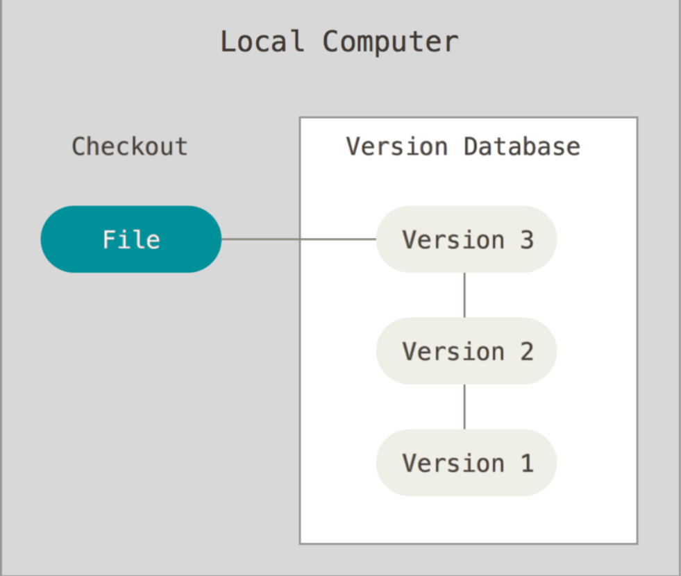

### Centralized Version Control Systems


### Distributed Version Control Systems


Every clone is really a full backup of all data

# A Short History of Git

# What is Git?

### Snapshots, Not Differences

The major difference between Git and other VCS: **the way Git thinks about its data**

1. other VCS: store information they stored as **a list of file-based changes**. commonly described as *delta-based* version control
   
    
    
2. git: Git thinks of its data more like **a series of snapshots of a miniature filesystem,** git thinks its data more like a **stream of snapshots** 


1. every time you commit
    1. git basically takes a picture of what all your files look like and stores as a reference
    2. if the file doesn’t change, just store a link to the previous identical file it has already stored

### Nearly Every Operation Is Local

 

most operations in git need only local files and resources to operate, you have a local copy

### Git Has Integrity

1. Everything in git is checksummed before it is stored and is then referred to by that checksum
2. This means it’s impossible to change the contents of any file or directory without git knowing about it
3. the mechanism above is called a **SHA-1 hash**
    1. a 40-chracter string composed of hexadecimal characters and calculated based on the contents of a file

### Git Generally Only Adds Data

### The Three States

1. modified: changed the file but have not committed to your local database
2. staged: marked a modified file in its current version to go into the next commit snapshot
3. committed: data is safely stored in your local database


more about stage: a file stores information about **what will go into your next commit**, git parlance is *index*

 

## The Command Line

## Installing Git

## First-Time Git Setup

### Git Config

1. `[path]/etc/gitconfig`: config for every user on the system and all repositories `git config --system`
2. `~/.gitconfig` or `~/.config/git/config`: config for you, the user `git config --global`, affects all of the repositories you work with
3. `.git/config` `git config --local`, in fact the default
4. each level overrides values in the previous level

### Your Identity

`git config --gloabl user.name "iceRabbit"`

`git config --global user.email xxx@xx.com`

### Your Editor

set up your custom editor, like notopad++, vim, but maybe the default one is enough

### Your default branch name

git will create a branch called *master* when creating a new repository with `git init` 

to set *main* as default name: `git config --global init.defaultBranch main`

### Checking Your Settings

`git config --list` to list all settings

## Getting Help

`git help config`

`git add -h`

## Summary

# Git Basics

## Getting a Git Repository

### Initializing a Repository in an Existing Directory

1. take a local directory and turn it into a git repository`git init`
2. *clone* an existing git repository `git clone`

### Cloning an Existing Repository

## Recording Changes to the Repository

the lifecycle of the status of files


### Checking the Status of Your Files

`git status` 

### Tracking New Files

`git add`

### Staging Modified Files

`git add`: a multipurpose command

1. to begin tracking new files
2. to stage files
3. to do other things like marking merge-conflicted files as resolved

maybe helpful to think of it more as *add precisely this content to the next commit* rather than add this file to the project

1. if you modify a file after you run `git add`, you have to run `git add` again to stage the latest version of the file 

### Short Status

| M | modified but not staged |
| --- | --- |
|    M | modified and staged |
| MM | staged and then modified again |

`git status -s` or `git status --short` 

### Ignoring Files

.gitignore file

### Viewing Your Staged and Unstaged Changes

`git diff`: shows the exact lines added and removed —the patch, as it were

### Committing Your Changes

`git commit -m "this is a commit message"`

1. anything that didn’t stage is still there modified
2. every time you perform a commit, you’re recording a snapshot of your project that you can revert to or compare later

### Skipping the Staging Area

use `git commit -a -m "this is a commit message"` to skip staging

`-a` makes git automatically stage every file that is already tracked before doing the commit

### Removing Files

`git rm` 

if you forget to add something to your `.gitignore` file and accidentally staged it, (like a large log file)

`git rm --cached` 

### Moving Files

`git mv file_from file_to`  

## Viewing the Commit History

- `git log` : list the commits made in that repository in reverse chronological order
    1. `git log -p` or `git log --patch` : to show the difference introduced in each commit
    2. `git log --stat` : to see abbreviated stats for each commit
    3. `git log --pretty` : changes the log output to formats other than the default 
        1. `git log --pretty=oneline` 
        2. `git log --pretty=format %h -%an, %ar : %s`
- author and committer
    - author: the person who originally wrote the work
    - committer: the person who last applied for the work

### Limiting Log Output

`git log --since=2.weeeks`  `git log --since="2008-01-15"` 

`git log --author=iceRabbit` 

`git log --grep` : search for keywords in the commit messages

`git log -S function_name` 

`git log --path /to/file` 

## Undoing Things

redo the commit: `git commit --amend` : takes your staging area and uses it for commit

```bash
git commit -m 'Initial commit'
git add forgotten_file
git commit --amend
```

the second commit replaces the results of the first

### Unstaging a Staged File

`git reset HEAD filename`

### Unmodifying a Modified File

`git checkout -- filename` 

anything that is committed in git can almost always be recovered

### Undoing things with git restore

from git version 2.23.0, git will use `git restore` instead of `git reset` for many undo operations

`git restore --staged filename`

## Working with Remotes

### Showing Your Remotes

`git remote -v`  : to see remote and url

### Adding Remote Repositories

`git remote add <shortname> <url>` 

### Fetching and Pulling from Your Remotes

`git fetch` : only downloads the data to your local repository

`git pull` : fetches data from the server and automatically tries to merge into the code you’re currently working on

`git clone` command automatically sets up your local master branch to track the remote master branch

### Pushing to Your Remotes

`git push <remote> <branch>` 

### Inspecting a Remote

`git remote show<remote>`

### Renaming and Removing Remotes

`git remote rename <oldname> <newname>`

`git remote remove <remote_name>`

## Tagging

typically, people use this functionality to mark release points

### Listing Your Tags

`git tag` -l or —list

`git tag -l "v1.8.5"`

### Creating Tags

git supports two types of tags: lightweight and annotated

1. Annotated
    1. have extra tag information
    2. `git tag -a v1.4 -m "my version 1.4"`
        1. -m: specifies a tagging message
2. Lightweight
    1. not keep other information
    2. `git show v1.4-lw`

### Tagging Later

you can also tag commits after you’ve moved past them

to tag the commit before: `git tag -a v1.2 <commit_checksum(or part of it)>`

### Sharing Tags

by default, git push command doesn’t transfer tags to remote servers

use `git push <remote< <tagname>` and `git push <remote> --tags` to push all tags

### Deleting Tags

on your local repository:

`git tag -d <tagname>`

to delete a tag from a remote server:

1. `git push <remote> :refs/tags/<tagname>`
2. `git push <remote> --delete <tagname>`

### Checking out Tags

`git checkout <tagname>`

this will put your repository in “detached HEAD” state:

1. if you make changes and create a commit, the tag will stay the same

## Git Aliases

you can set up an alias for each command using `git config`

not for me now

# Git Branching

## Branches in a Nutshell

### What exactly is a Branch

1. Branching means you diverge from the main line of development and continue to do work without messing with that main line
2. first commit and its tree:
   
    
    
    after you create the commit by running git commit:
    
    1. 3 blobs: each representing the contents of one of the three files
    2. tree: lists all contents of the directory and specifies which file names are stored as which blobs
    3. commit: with the pointer to that root tree and all the commit metadata
3. if you make some changes and commit again:
   
    
    
    the next commit stores a pointer to the commit that came immediately before it
    
4. **A branch in git is simply a lightweight movable pointer to one of these commits**
   
    
    
    1. as you start making commits, you’re given a master branch that points to the last commit you made
    2. every time you commit, the master branch pointer moves forward automatically

### Creating a New Branch

`git branch <branch_name>` 

1. create a new pointer (to the same commit you’re currently on) for you to move around
   
    
    
2. How does git know what branch you’re currently on?
    1. HEAD: a pointer to the local branch you’re currently on
    2. in this case: you are still on master, just create a branch, not switch to
    3. use `git log --decorate` to see where the branch pointers are pointing
    
    
    

### Switching Branches

`git checkout testing`

1. this moves HEAD to point to the testing branch
   
    
    
2. make another commit now: `git commit -a -m 'made a change'` 
   
    
    
    1. now testing branch has moved forward, but master branch still points to the commit you were on when you ran git checkout
3. now switch back to master: `git checkout master`
   
    
    
    1. moved the HEAD pointer back to point the master branch
    2. reverted the files in your working directory back to the snapshot that master points to
    3. the changes you make from this point forward will diverge from an older version of the project
    4. it essentially rewinds the work you’ve done in your testing branch so you can go in a different direction
4. make a few changes and commit again: `git commit -a -m 'made other changes'`
   
    
    
    `git log --decorate --graph --all`
    
5. creating a new branch is as quick and simple as writing 41 bytes to a file
    1. Branch in git is actually a simple file that contains 40 character SHA-1 checksum of the commit it points to

## Basic Branching and Merging

### Basic Branching


`git checkout master` 

`git merge hotfix`


master is fast-forwarded to hotfix, now just delete the hotfix branch, the master branch points at the same place

`git branch -d hotfix` 

`git checkout iss53`


### Basic Merging

All you have to do is check out the branch you wish to merge into and then run `git merge`

`git checkout master`

`git merge iss53`

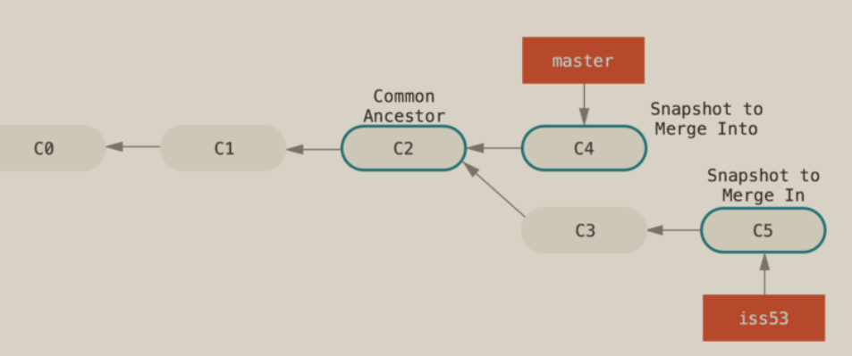

git creates a new snapshot that results from this three-way merge and automatically creates a new commit that points to it

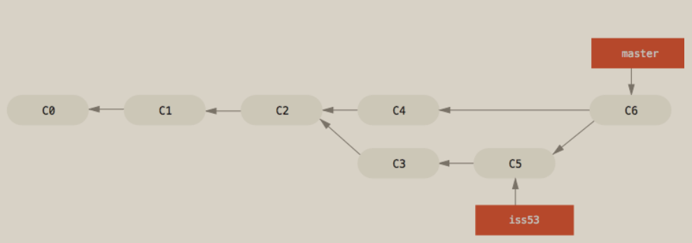

### Basic Merge Conflicts

if you changed the same part of the same file differently in the two branches you’re merging, git won’t be able to merge them cleanly

to see which files are unmerged at any point after a merge conflict, run `git status`

## Branch Management

`git branch` with no arguments, you get a simple listing of your branches

`git branch -v` to see the last commit on each branch

`git branch --merged` `git branch --no-merged` can filter the list to branches that you have or have not yet merged into the branch you’re currently on

about rename

1. rename the branch locally with `git branch --move bad-branch-name corrected-branch-name` 
2. the branch with the bad name is still present on the remote, to delete it `git push <remote> --delete bad-branch-name`
3. rename your local master branch into main with `git branch --move master main`
4. to let others see the new main branch `git push --set-upstream <remote> main`  

## Branching Workflows

### Long Running Branches

you can have several branches that are always open and that you use for different stages of your development cycle

### Topic Branches

a topic branch is a short-lived branch that you create and use for a single particular feature or related work

you can use topic branches to solve issues in different ways

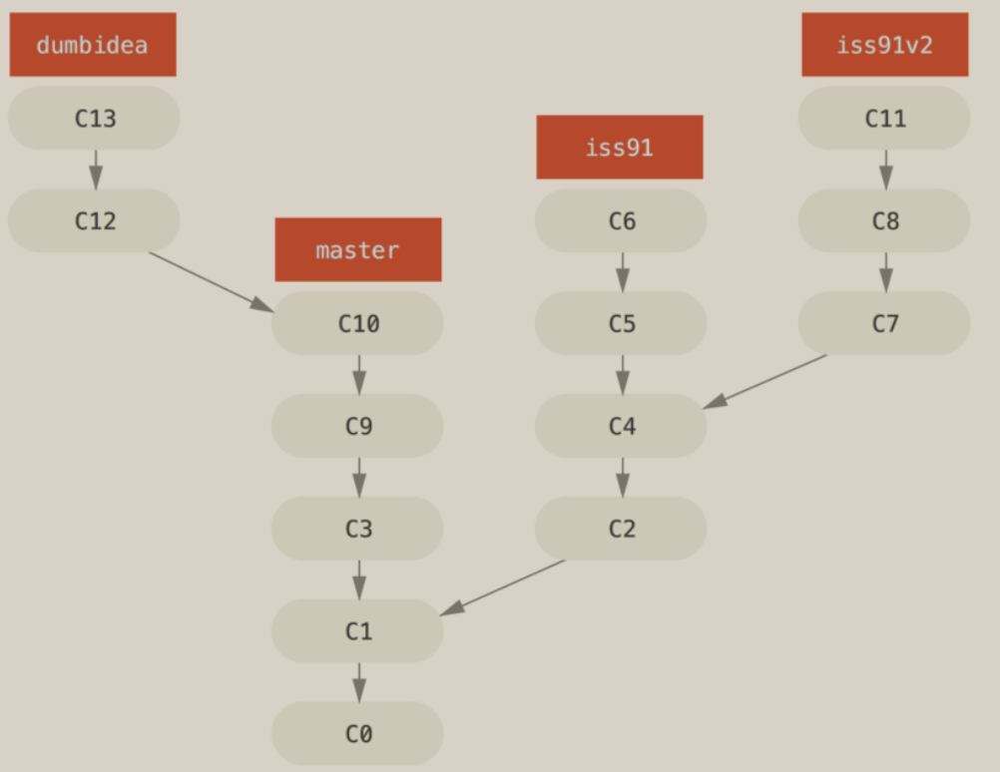

## Remote Branches

remote-tracking branches are references to the state of remote branches. think of them as bookmarks, to remind you where the branches in your remote repositories where the last time you connected to them

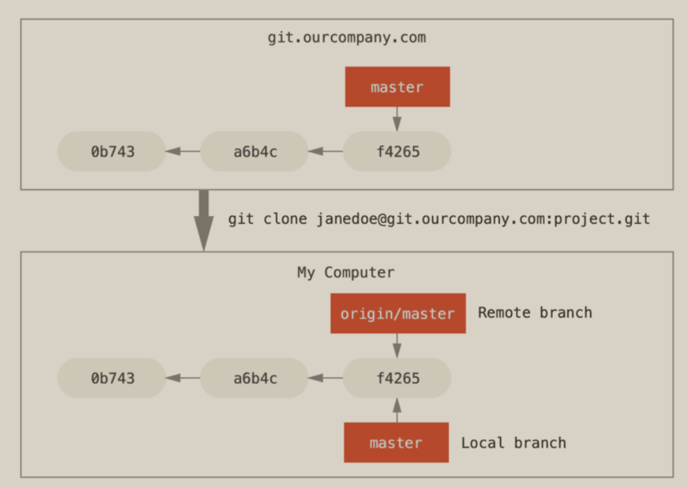

if someone else pushes to git server and updates its master branch

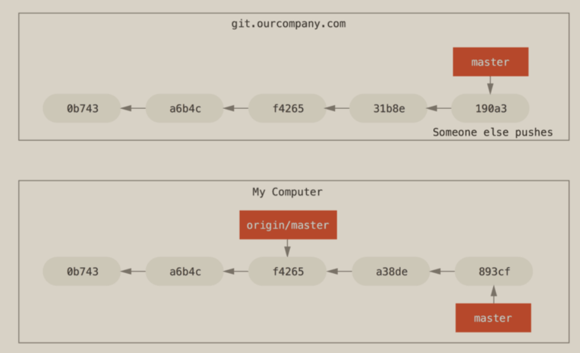

to synchronize your work with a given remote, use `git fetch <remote>`

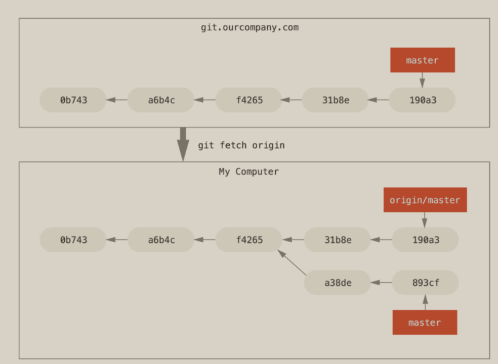

### Pushing

`git push <remote> <branch>`

### Tracking Branches

checking out a local branch from a remote-tracking branch automatically creates what is called a tracking branch (the branch it tracks is called an upstream branch)

`git checkout --track <remote> <branch>`

`git checkout -b <your_local_branch_name> <remote> <branch>`

to set your local branch to a remote branch or want to change the upstream branch you’re tracking, use `git branch -u <remote> <branch>` or `git branch --set-upstream-to`  

to see what tracking branches you have set up, use `git branch -vv`

### Pulling

`git fetch` will fetch all the changes on the server that you don’t have yet, it will not modify your working directory at all

`git pull`: essentially a `git fetch` immediately followed by a `git merge` in most cases

### Deleting Remote Branches

`git push <remote> --delete <branch>`

## Rebasing

### The Basic Rebase

take the patch of the change that was introduced in C4 and reapply it on top of C3

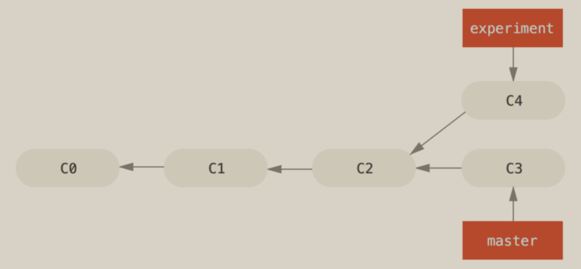

`git checkout experiment` 

`git rebase master`

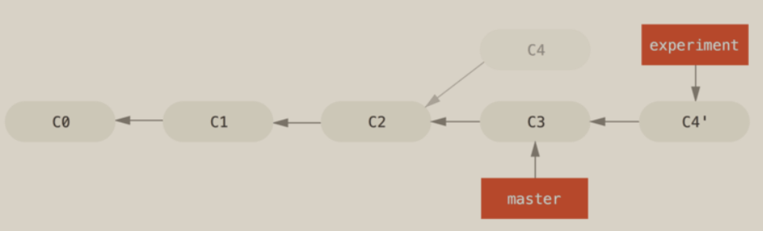

compared to merge:

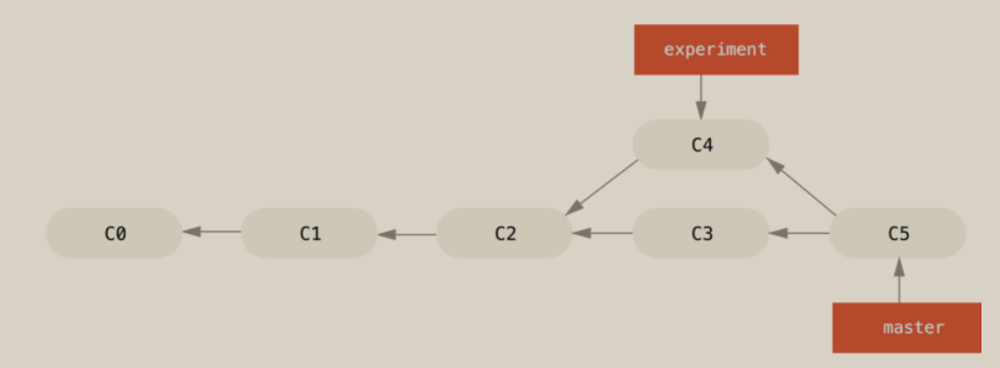

1. rebasing makes for a cleaner history
2. often, you’ll do rebase to make sure your commits apply cleanly on a remote branch
3. rebasing replays changes from one line of work onto another in the order they were introduced, whereas merging takes the endpoints and merges them together

### More Interesting Rebases

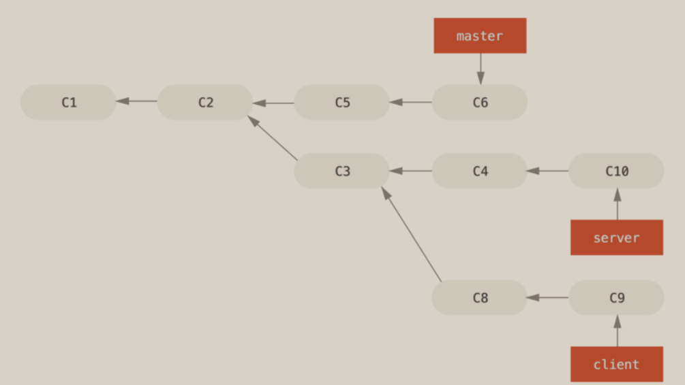

suppose you want to merge client-side changes into mainline for a release. but want to hold off on the server-side changes until it’s tested further

`git rebase --onto master server client`

this command: take the client branch, figure out the patches since it diverged from the server branch, and replay these patches in the client branch as if it was based directly off the master branch instead

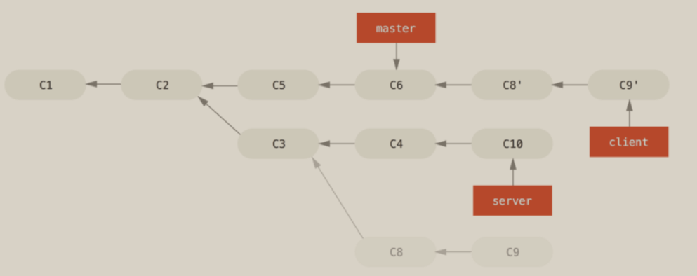

`git rebase <basebranch> <topicbranch>`: checks out the topic branch for you and replays it onto the base branch

### The Perils of Rebasing

**Do not rebase commits that exist outside your repository and that people may have based work on**

### Rebase When You Rebase

补救方法

### Rebase vs. Merge

what history mean

1. one point of view is that the commit history is **a record of what actually happened**
2. another opposing point of view is that the commit history is the **story of how your project was made**
3. you can get the best of both worlds: rebase local changes before pushing to clean up your work, but never rebase anything that you’ve pushed somewhere

# Git on the Server

# Distributed Git

## Distributed Workflows

in git

1. every developer is potentially both a node and a hub, that is,
2. every developer can both contribute code to other repositories and maintain a public repository on which others can base their work and which they can contribute to

### Centralized Workflow

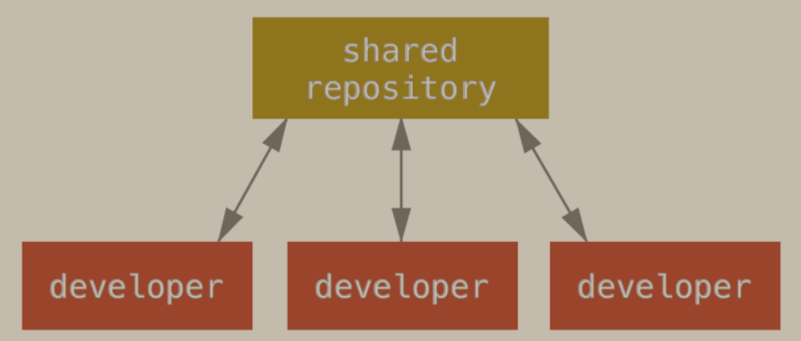

### Integration-Manager Workflow

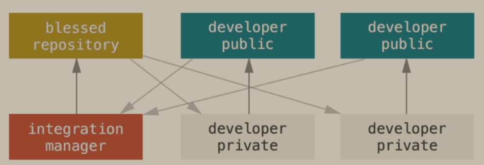

### Dictator and Lieutenants Workflow

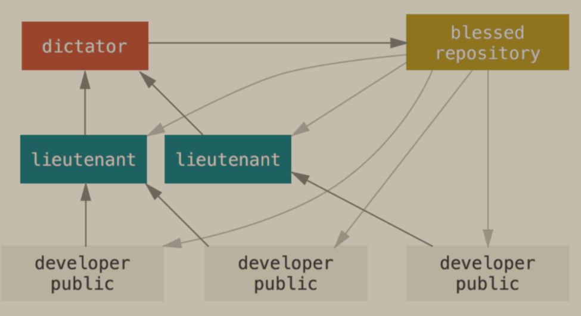

## Contributing to a Project

three variables on how to contribute to a project:

1. active contributor
2. the workflow in use for the project
3. your commit access

### Commit Guidelines

1. your submissions should not contain any whitespace errors
2. try to make each commit a logically separate changeset
3. commit message should be no more than 50 characters, describes the changeset concisely

### Private Small Team

### Maintaining a Project

# GitHub

## Account Setup and Configuration

## Contributing to a Project

### Forking Projects

1. if you want to contribute to an existing project to which you don’t have push access, you can fork the project
2. GitHub will make a copy of the project that is entirely yours, it lives in your namespace, and you can push to it

### The GitHub Flow

GitHub is designed around a particular collaboration workflow, **centered on Pull Requests**

how it generally works:

1. fork the project
2. create a topic branch from master
3. make some commits to improve the project
4. push this branch to your github project
5. open a Pull Request on github
6. discuss, and optionally continue committing
7. the project owner merges or closes the pull request
8. sync the updated master back to your fork

### Creating a Pull Request

### Pull Request as Patches

most github projects think about Pull Request  branches as iterative conversations around a proposed change, culminating in a unified diff that is applied by merging

### Keeping up with Upstream

most developers on github will choose to merge the target branch if there are some conflicts in their PRs

### References

#<num> username#<num> username/repo#<num>

### GitHub Flavored Markdown

## Maintaining a Project